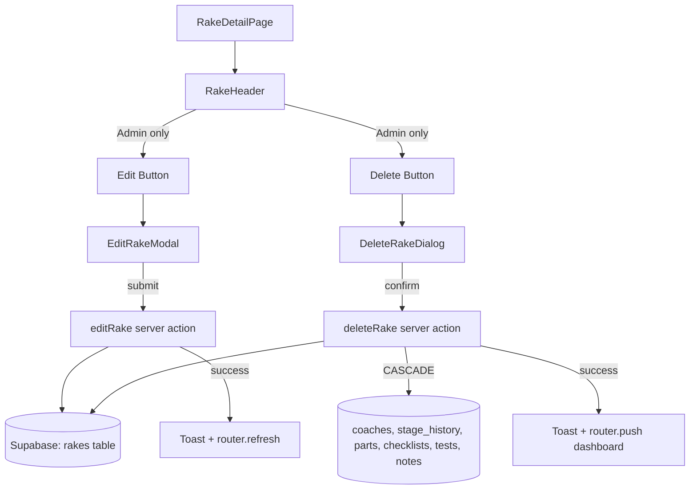

# Design Document: Admin Rake Edit & Delete

## Overview

This feature adds two admin-only operations to the rake detail page: editing rake metadata and permanently deleting a rake with all associated data. Both operations are gated behind the Admin role at both the UI and server-action level.

The delete flow uses a confirmation dialog, invokes a server action that deletes the rake row (relying on existing `ON DELETE CASCADE` foreign keys to remove all child data), then redirects to the dashboard with a success toast. The edit flow opens a modal form pre-populated with current rake details, validates input using the existing Zod schema, updates the rake record, and refreshes the page.

Both operations follow the established patterns in the codebase: server actions with `verifyAdmin()` guard, `Result<T>` return types, Zod validation, audit logging, and toast-based feedback.

## Architecture



The architecture adds two new UI components and two new server actions, integrating into the existing rake detail page flow:

1. `RakeHeader` gains conditional edit/delete buttons (visible only to Admin users via `useAuth()` role check)
2. `DeleteRakeDialog` — a specialized confirmation modal showing the rake number and cascade warning
3. `EditRakeModal` — a form modal reusing validation from `rake.ts` schema
4. `deleteRake` server action — verifies admin, deletes rake row, relies on DB CASCADE
5. `editRake` server action — verifies admin, validates input, checks duplicate rake number, updates rake row

## Components and Interfaces

### Modified: RakeHeader

The existing `RakeHeader` component will be extended with:
- New props: `rakeId: string`, `rakeCategory: RakeCategory`, `shedId: string`, `estimatedCompletionDate?: string`
- Conditional rendering of Edit and Delete icon buttons (only when `useAuth().user?.role === 'Admin'`)
- State management for opening/closing the edit modal and delete dialog

```typescript
// Additional props added to RakeHeaderProps
interface RakeHeaderProps {
  // ... existing props
  rakeId: string;
  rakeCategory: RakeCategory;
  shedId: string;
}
```

### New: DeleteRakeDialog

A confirmation dialog built on the existing `Modal` component.

```typescript
interface DeleteRakeDialogProps {
  open: boolean;
  onClose: () => void;
  rakeId: string;
  rakeNumber: string;
}
```

Behavior:
- Displays rake number and a warning about permanent cascade deletion
- Confirm button triggers `deleteRake` server action
- Loading state disables both buttons during deletion
- On success: closes dialog, shows success toast, redirects to `/`
- On failure: closes dialog, shows error toast, stays on page

### New: EditRakeModal

A form modal built on the existing `Modal` component, with fields matching the registration form Step 1.

```typescript
interface EditRakeModalProps {
  open: boolean;
  onClose: () => void;
  rakeId: string;
  currentValues: {
    rakeNumber: string;
    rakeCategory: RakeCategory;
    rakeType: RakeType;
    pohType: POHType;
    shedId: string;
    totalCoaches: number;
    intakeDate: string;
  };
}
```

Behavior:
- Pre-populates all fields with `currentValues`
- Uses `rakeDetailsSchema` + `intakeDateSchema` for client-side validation
- Save button triggers `editRake` server action
- Loading state disables both buttons during save
- On success: closes modal, shows success toast, calls `router.refresh()`
- On failure: shows error toast, keeps modal open for retry
- Inline validation errors displayed per field

### New Server Actions (in `src/lib/actions/rake.ts`)

```typescript
// Delete a rake and all associated data (cascade)
export async function deleteRake(rakeId: string): Promise<Result<void>>

// Edit rake metadata
export async function editRake(input: {
  rakeId: string;
  rakeNumber: string;
  rakeCategory: RakeCategory;
  rakeType: RakeType;
  pohType: POHType;
  shedId: string;
  totalCoaches: number;
  intakeDate: string;
}): Promise<Result<void>>
```

### New Permission Helpers (in `src/lib/auth/permissions.ts`)

```typescript
export function canDeleteRake(role: UserRole): boolean {
  return ADMIN_ONLY.includes(role);
}

export function canEditRake(role: UserRole): boolean {
  return ADMIN_ONLY.includes(role);
}
```

## Data Models

### Existing Database Schema (No Changes Required)

The database already has the necessary CASCADE constraints:

- `coaches.rake_id` → `rakes.id` ON DELETE CASCADE
- `coach_stage_history.coach_id` → `coaches.id` ON DELETE CASCADE
- `coach_section_status.coach_id` → `coaches.id` ON DELETE CASCADE
- `coach_parts.coach_id` → `coaches.id` ON DELETE CASCADE
- `coach_checklist_items.coach_id` → `coaches.id` ON DELETE CASCADE
- `coach_tests.coach_id` → `coaches.id` ON DELETE CASCADE
- `notes.coach_id` → `coaches.id` ON DELETE CASCADE

Deleting a rake row triggers automatic cascade deletion of all coaches and their child records. No migration is needed.

### Existing Validation Schema (Reused)

The `rakeDetailsSchema` from `src/lib/validations/rake.ts` is reused for edit validation:
- `rakeNumber`: string, 1-50 chars
- `rakeCategory`: enum `EMU | MEMU`
- `rakeType`: enum `3-Phase Rake | Conventional Rake`
- `pohType`: enum `1st POH | 2nd POH | 3rd POH | 4th POH`
- `shedId`: non-empty string
- `totalCoaches`: integer 6-20

The `intakeDateSchema` is reused for intake date validation (no future dates).

### Edit Action Schema

A new Zod schema extending `rakeDetailsSchema` for the edit action:

```typescript
const editRakeSchema = rakeDetailsSchema.extend({
  rakeId: z.string().uuid(),
  intakeDate: intakeDateSchema,
});
```

### Audit Log Entries

Both operations write to the existing `audit_logs` table:
- Delete: `action='DELETE'`, `entity_type='rake'`, `old_values` contains rake snapshot
- Edit: `action='UPDATE'`, `entity_type='rake'`, `old_values` and `new_values` contain before/after


## Correctness Properties

*A property is a characteristic or behavior that should hold true across all valid executions of a system — essentially, a formal statement about what the system should do. Properties serve as the bridge between human-readable specifications and machine-verifiable correctness guarantees.*

### Property 1: Admin-only action enforcement

*For any* user with a non-Admin role (Senior_Section_Engineer, Junior_Engineer, Technician, Viewer), invoking either the `deleteRake` or `editRake` server action should return `{ success: false, error: 'Unauthorized' }` without modifying any database records.

**Validates: Requirements 1.1, 1.4, 4.1, 6.1, 6.4, 8.1**

### Property 2: Non-Admin UI button visibility

*For any* user role that is not Admin, rendering the `RakeHeader` component should produce output that does not contain edit or delete action buttons.

**Validates: Requirements 1.2, 6.2**

### Property 3: Cascade deletion completeness

*For any* rake that has coaches with associated stage history, section status, parts, checklist items, tests, and notes, after successfully invoking `deleteRake`, querying the `rakes`, `coaches`, `coach_stage_history`, `coach_section_status`, `coach_parts`, `coach_checklist_items`, `coach_tests`, and `notes` tables for records referencing that rake or its coaches should return zero rows.

**Validates: Requirements 3.1, 3.2, 3.3, 3.4, 3.5, 3.6, 3.7, 3.8, 4.2, 4.5**

### Property 4: Edit round trip

*For any* valid rake edit input (valid rake number, rake category, rake type, POH type, shed ID, total coaches 6-20, non-future intake date), after invoking `editRake` on an existing rake, querying that rake from the database should return the updated values matching the input.

**Validates: Requirements 8.2**

### Property 5: Edit validation rejects invalid input

*For any* input that violates the rake validation schema (empty rake number, rake number exceeding 50 characters, total coaches outside 6-20, future intake date, invalid enum values), the `editRake` server action should return `{ success: false }` with an error message, and the rake record in the database should remain unchanged.

**Validates: Requirements 7.3, 8.3**

### Property 6: Coach records preserved on total_coaches change

*For any* existing rake with N coach records, invoking `editRake` with a different `totalCoaches` value should update only the `total_coaches` column on the rake row. The number of coach records in the `coaches` table for that rake should remain N (unchanged).

**Validates: Requirements 8.7**

## Error Handling

| Scenario | Handler | Behavior |
|---|---|---|
| Non-Admin invokes delete/edit action | Server action `verifyAdmin()` | Returns `{ success: false, error: 'Unauthorized' }` |
| Rake ID not found (delete) | `deleteRake` action | Returns `{ success: false, error: 'Rake not found' }` |
| Rake ID not found (edit) | `editRake` action | Returns `{ success: false, error: 'Rake not found' }` |
| Duplicate rake number at same shed (edit) | `editRake` action | Returns `{ success: false, error: 'An active rake with number "X" already exists at this shed' }` |
| Validation failure (edit) | `editRake` action + client-side | Server returns Zod error messages; client shows inline field errors |
| Database error (delete) | `deleteRake` action | Returns `{ success: false, error: <db error message> }` |
| Database error (edit) | `editRake` action | Returns `{ success: false, error: <db error message> }` |
| Delete action fails | `DeleteRakeDialog` | Closes dialog, shows error toast, user stays on rake detail page |
| Edit action fails | `EditRakeModal` | Shows error toast, keeps modal open for retry |
| Network error | Client components | Caught in try/catch, shows generic error toast |

Both server actions follow the existing `Result<T>` pattern used throughout the codebase. Audit log writes are non-blocking (failures are logged to console but don't affect the operation result).

## Testing Strategy

### Unit Tests

Unit tests cover specific examples, edge cases, and UI interactions:

- Delete button and edit button render only for Admin role (component render test)
- Delete confirmation dialog shows rake number and warning text
- Cancel button closes dialog/modal without side effects
- Loading state disables buttons during async operations
- Delete action returns error for non-existent rake ID (edge case from 4.3)
- Edit action returns error for duplicate rake number at same shed (example from 8.5)
- Post-delete redirects to dashboard
- Post-edit refreshes page data
- Success/error toasts display correct messages

### Property-Based Tests

Property-based tests verify universal properties across generated inputs. Use `fast-check` as the PBT library for TypeScript/JavaScript.

Each property test must:
- Run a minimum of 100 iterations
- Reference its design document property with a tag comment
- Use `fast-check` arbitraries to generate random valid/invalid inputs

Property tests to implement:

1. **Feature: admin-rake-delete, Property 1: Admin-only action enforcement** — Generate random non-Admin roles, invoke delete/edit actions, assert unauthorized result and no DB changes.

2. **Feature: admin-rake-delete, Property 2: Non-Admin UI button visibility** — Generate random non-Admin roles, render RakeHeader, assert no edit/delete buttons in output.

3. **Feature: admin-rake-delete, Property 3: Cascade deletion completeness** — Generate a rake with random coaches and child data, delete it, assert all related tables are empty for that rake.

4. **Feature: admin-rake-delete, Property 4: Edit round trip** — Generate random valid rake metadata, edit an existing rake, query it back, assert all fields match.

5. **Feature: admin-rake-delete, Property 5: Edit validation rejects invalid input** — Generate random invalid inputs (empty strings, out-of-range numbers, future dates), invoke edit action, assert rejection and unchanged DB state.

6. **Feature: admin-rake-delete, Property 6: Coach records preserved on total_coaches change** — Generate random totalCoaches values (6-20), edit an existing rake, assert coach record count is unchanged.

### Test Configuration

```typescript
import fc from 'fast-check';

// All property tests use at least 100 iterations
const PBT_CONFIG = { numRuns: 100 };
```
