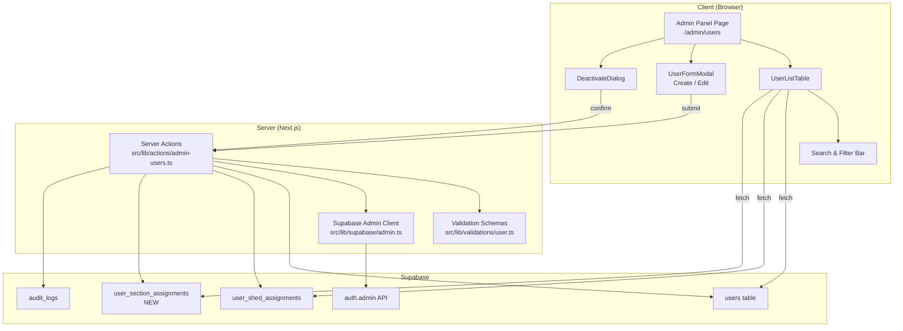
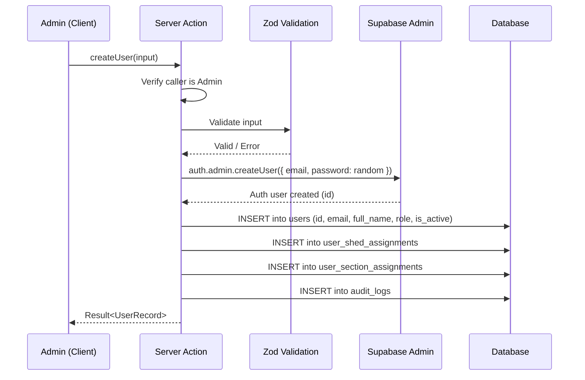

# Design Document: Admin User Management

## Overview

This feature adds an Admin User Management panel to the Railway POH Management System, enabling Admin users to create, view, edit, deactivate, and reactivate user accounts directly from the application UI. The panel lives at `/admin/users` within the existing `(dashboard)` route group and leverages the Supabase Admin API (via a service-role key on the server) for user account creation and status management. Section assignments are stored in a new `user_section_assignments` table, and all management actions are recorded in the existing `audit_logs` table.

The design follows the existing patterns in the codebase: Zod for form validation, server actions for mutations, the Supabase SSR client for data fetching, and the existing RLS + `is_admin()` helper for authorization.

## Architecture



### Key Architectural Decisions

1. **Supabase Admin Client (service_role key)**: User creation and ban/unban operations require the Supabase Admin API, which needs the `service_role` key. This key is only used server-side in a dedicated `src/lib/supabase/admin.ts` module, never exposed to the client. The existing `server.ts` client uses the anon key and cannot perform admin operations.

2. **Server Actions for all mutations**: All create/update/deactivate/reactivate operations are implemented as Next.js server actions in `src/lib/actions/admin-users.ts`. Each action verifies the caller is an Admin before proceeding, providing server-side authorization independent of client-side checks.

3. **Route within (dashboard) group**: The admin panel is placed at `src/app/(dashboard)/admin/users/page.tsx`, reusing the existing dashboard layout (sidebar, header, shed context). The sidebar gains a new "User Management" nav item visible only to Admin users.

4. **Client-side filtering, server-side data**: The user list is fetched server-side via Supabase queries. Search and filter operations are performed client-side on the fetched dataset since the total user count in a railway shed system is expected to be in the low hundreds at most.

5. **Soft delete via is_active + Supabase ban**: Deactivation sets `is_active = false` on the `users` table AND calls `auth.admin.updateUserById` with `{ ban_duration: 'none' }` to disable the Supabase Auth account. Reactivation reverses both. This ensures deactivated users cannot log in even if they have a valid session cookie.

## Components and Interfaces

### New Files

| File | Purpose |
|------|---------|
| `src/app/(dashboard)/admin/users/page.tsx` | Admin user management page (server component for data fetching) |
| `src/components/admin/user-list-table.tsx` | Client component: table with search, filter, and action buttons |
| `src/components/admin/user-form-modal.tsx` | Client component: create/edit user modal form |
| `src/components/admin/deactivate-dialog.tsx` | Client component: confirmation dialog for deactivate/reactivate |
| `src/lib/actions/admin-users.ts` | Server actions: createUser, updateUser, deactivateUser, reactivateUser |
| `src/lib/supabase/admin.ts` | Supabase admin client using service_role key |
| `src/lib/validations/user.ts` | Zod schemas for user creation and edit forms |
| `supabase/migrations/005_user_sections_and_status.sql` | Migration: user_section_assignments table + is_active column |

### Modified Files

| File | Change |
|------|--------|
| `src/components/layout/sidebar.tsx` | Add "User Management" nav item for Admin role |
| `src/types/index.ts` | Add `SectionName` type and admin-related types |
| `src/lib/constants.ts` | Add `SECTION_NAMES` constant array |
| `middleware.ts` | No change needed — existing auth middleware already protects all dashboard routes |

### Component Interfaces

```typescript
// src/types/index.ts (additions)
export type SectionName =
  | 'Pneumatic'
  | 'Bogey/Bogie'
  | 'Electrical'
  | 'Traction Motor'
  | 'Brake System'
  | 'Body Shell';

export interface UserRecord {
  id: string;
  email: string;
  full_name: string;
  role: UserRole;
  is_active: boolean;
  created_at: string;
  shed_assignments: { shed_id: string; shed_name: string }[];
  section_assignments: { shed_id: string; section_name: SectionName }[];
}

export interface CreateUserInput {
  email: string;
  full_name: string;
  role: UserRole;
  shed_ids: string[];
  section_assignments: { shed_id: string; section_name: SectionName }[];
}

export interface UpdateUserInput {
  user_id: string;
  full_name: string;
  role: UserRole;
  shed_ids: string[];
  section_assignments: { shed_id: string; section_name: SectionName }[];
}
```

```typescript
// src/lib/actions/admin-users.ts
'use server';

export async function createUser(input: CreateUserInput): Promise<Result<UserRecord>>;
export async function updateUser(input: UpdateUserInput): Promise<Result<UserRecord>>;
export async function deactivateUser(userId: string): Promise<Result<void>>;
export async function reactivateUser(userId: string): Promise<Result<void>>;
export async function fetchUsers(): Promise<Result<UserRecord[]>>;
```

```typescript
// src/lib/supabase/admin.ts
'use server';

// Creates a Supabase client with the service_role key for admin operations.
// MUST only be used in server actions / server components.
export async function createAdminClient(): Promise<SupabaseClient>;
```

### UserListTable Props

```typescript
interface UserListTableProps {
  users: UserRecord[];
  sheds: { id: string; name: string }[];
  onRefresh: () => void;
}
```

### UserFormModal Props

```typescript
interface UserFormModalProps {
  open: boolean;
  onClose: () => void;
  onSuccess: () => void;
  user?: UserRecord; // undefined = create mode, defined = edit mode
  sheds: { id: string; name: string }[];
}
```

### DeactivateDialog Props

```typescript
interface DeactivateDialogProps {
  open: boolean;
  onClose: () => void;
  onConfirm: () => void;
  user: UserRecord;
  action: 'deactivate' | 'reactivate';
  loading: boolean;
}
```


## Data Models

### New Table: `user_section_assignments`

```sql
CREATE TABLE user_section_assignments (
  id UUID PRIMARY KEY DEFAULT gen_random_uuid(),
  user_id UUID NOT NULL REFERENCES users(id) ON DELETE CASCADE,
  shed_id UUID NOT NULL REFERENCES sheds(id) ON DELETE CASCADE,
  section_name VARCHAR(50) NOT NULL CHECK (
    section_name IN ('Pneumatic', 'Bogey/Bogie', 'Electrical', 'Traction Motor', 'Brake System', 'Body Shell')
  ),
  created_at TIMESTAMPTZ DEFAULT NOW(),
  UNIQUE(user_id, shed_id, section_name)
);

CREATE INDEX idx_user_section_user ON user_section_assignments(user_id);
CREATE INDEX idx_user_section_shed ON user_section_assignments(shed_id);
```

### Schema Change: `users` table

```sql
ALTER TABLE users ADD COLUMN is_active BOOLEAN DEFAULT true NOT NULL;
```

### RLS Policies for `user_section_assignments`

```sql
ALTER TABLE user_section_assignments ENABLE ROW LEVEL SECURITY;

-- Admin can perform all CRUD operations
CREATE POLICY "Admin can manage section assignments"
  ON user_section_assignments FOR ALL TO authenticated
  USING (is_admin())
  WITH CHECK (is_admin());

-- Non-admin users can read their own assignments
CREATE POLICY "Users can view own section assignments"
  ON user_section_assignments FOR SELECT TO authenticated
  USING (user_id = auth.uid());
```

### Zod Validation Schemas

```typescript
// src/lib/validations/user.ts
import { z } from 'zod';

const SECTION_NAMES = [
  'Pneumatic', 'Bogey/Bogie', 'Electrical',
  'Traction Motor', 'Brake System', 'Body Shell',
] as const;

const ROLES = ['Admin', 'Section_Engineer', 'Technician', 'Viewer'] as const;

export const createUserSchema = z.object({
  email: z.string().email('Enter a valid email address'),
  full_name: z.string().min(1, 'Full name is required').max(200),
  role: z.enum(ROLES, { message: 'Select a role' }),
  shed_ids: z.array(z.string().uuid()).min(1, 'Select at least one shed'),
  section_assignments: z.array(z.object({
    shed_id: z.string().uuid(),
    section_name: z.enum(SECTION_NAMES),
  })).default([]),
});

export const updateUserSchema = z.object({
  user_id: z.string().uuid(),
  full_name: z.string().min(1, 'Full name is required').max(200),
  role: z.enum(ROLES, { message: 'Select a role' }),
  shed_ids: z.array(z.string().uuid()).min(1, 'Select at least one shed'),
  section_assignments: z.array(z.object({
    shed_id: z.string().uuid(),
    section_name: z.enum(SECTION_NAMES),
  })).default([]),
});
```

### Audit Log Entries

All user management actions write to the existing `audit_logs` table with:

| Action | entity_type | old_values | new_values |
|--------|-------------|------------|------------|
| CREATE | `user` | `null` | `{ email, full_name, role, shed_ids, sections }` |
| UPDATE | `user` | `{ full_name, role, shed_ids, sections }` | `{ full_name, role, shed_ids, sections }` |
| DEACTIVATE | `user` | `{ is_active: true }` | `{ is_active: false }` |
| REACTIVATE | `user` | `{ is_active: false }` | `{ is_active: true }` |

### Server Action Flow: Create User



Note: The created user receives an invite/password-reset email from Supabase to set their password. The initial password is a cryptographically random string that is never stored or displayed.


## Correctness Properties

*A property is a characteristic or behavior that should hold true across all valid executions of a system — essentially, a formal statement about what the system should do. Properties serve as the bridge between human-readable specifications and machine-verifiable correctness guarantees.*

### Property 1: Non-Admin users are denied access

*For any* user with a role that is not Admin, attempting to access the admin user management page should result in a redirect to the dashboard and no user management content being rendered.

**Validates: Requirements 1.2**

### Property 2: Search filter correctness

*For any* list of user records and any search query string, the filtered results should contain only users whose full name or email contains the query as a case-insensitive substring, and every user matching the query should be included.

**Validates: Requirements 2.2**

### Property 3: Attribute filter correctness

*For any* list of user records and any selected role filter and/or shed filter, the filtered results should contain only users matching all applied filters, and every user matching all filters should be included.

**Validates: Requirements 2.3, 2.4**

### Property 4: User creation round-trip

*For any* valid create-user input (valid email, non-empty name, valid role, at least one shed, zero or more section assignments), after successful creation, fetching the user by ID should return a record with matching email, full_name, role, shed assignments, and section assignments.

**Validates: Requirements 3.2, 6.2, 6.3, 6.4**

### Property 5: Invalid input rejection

*For any* create-user input that violates the Zod schema (invalid email format, empty full name, missing role, or empty shed list), validation should reject the input and no user record should be created.

**Validates: Requirements 3.4, 3.5, 3.6, 9.1, 9.2, 9.3, 9.4**

### Property 6: User update round-trip

*For any* existing user and any valid update input (new role, new shed assignments, new section assignments), after successful update, fetching the user should return a record reflecting all the new values.

**Validates: Requirements 4.2, 4.3, 4.4**

### Property 7: Last Admin protection

*For any* set of users where exactly one user has the Admin role, attempting to change that user's role to a non-Admin role should fail and the user's role should remain Admin.

**Validates: Requirements 4.5**

### Property 8: Deactivate/reactivate round-trip

*For any* active user, deactivating them should set is_active to false, and subsequently reactivating them should set is_active back to true, restoring the original active state.

**Validates: Requirements 5.2, 5.4**

### Property 9: Deactivated users cannot authenticate

*For any* user with is_active set to false, authentication attempts for that user's email should be rejected.

**Validates: Requirements 5.3**

### Property 10: Section assignment unique constraint

*For any* user, shed, and section combination, attempting to insert a duplicate section assignment (same user_id, shed_id, section_name) should fail with a constraint violation.

**Validates: Requirements 7.3**

### Property 11: Audit log completeness

*For any* user management action (create, update, deactivate, reactivate), after the action completes, the audit_logs table should contain an entry with the correct action type, entity_type "user", the target user's ID as entity_id, and appropriate old_values/new_values reflecting the change.

**Validates: Requirements 8.1, 8.2, 8.3**

### Property 12: RLS policy enforcement for section assignments

*For any* Admin user, all CRUD operations on user_section_assignments should succeed. *For any* non-Admin user, only SELECT on their own assignments (where user_id matches) should succeed, and INSERT/UPDATE/DELETE should be denied.

**Validates: Requirements 7.4**

## Error Handling

### Client-Side Errors

| Scenario | Handling |
|----------|----------|
| Form validation failure | Inline error messages below each invalid field via Zod + react-hook-form. Form data is preserved. |
| Network error during submission | Toast notification with "Network error. Please check your connection and try again." Form data is preserved for retry. |
| Duplicate email error | Toast notification with "This email is already registered." |
| Rate limit error from Supabase | Toast notification with "Too many requests. Please wait a moment before retrying." |
| Last Admin role change | Inline warning preventing form submission: "At least one Admin user must exist." |

### Server-Side Errors

| Scenario | Handling |
|----------|----------|
| Caller is not Admin | Return `{ success: false, error: 'Unauthorized' }`. Do not expose internal details. |
| Supabase Admin API failure | Return `{ success: false, error: 'Failed to create user account. Please try again.' }`. Log the actual error server-side. |
| Database insert failure | Return `{ success: false, error: 'Failed to save user data. Please try again.' }`. Attempt rollback of partial operations (e.g., delete the auth account if the users table insert fails). |
| Audit log insert failure | Log the error server-side but do not fail the primary operation. Audit logging is non-blocking. |

### Rollback Strategy for User Creation

User creation involves multiple steps (auth account → users row → shed assignments → section assignments). If any step after auth account creation fails:

1. Delete the Supabase Auth account via `auth.admin.deleteUser()`
2. Return an error to the client

This prevents orphaned auth accounts without corresponding database records.

## Testing Strategy

### Dual Testing Approach

This feature uses both unit tests and property-based tests for comprehensive coverage.

- **Unit tests**: Verify specific examples, edge cases, integration points, and UI behavior
- **Property tests**: Verify universal properties across randomly generated inputs

### Property-Based Testing Configuration

- **Library**: [fast-check](https://github.com/dubzzz/fast-check) (TypeScript property-based testing library)
- **Minimum iterations**: 100 per property test
- **Tag format**: `Feature: admin-user-management, Property {number}: {property_text}`
- Each correctness property is implemented by a single property-based test

### Unit Tests

| Test | Validates |
|------|-----------|
| Admin user sees the user management page with all controls | Req 1.1 |
| Add User button opens form with all required fields | Req 3.1 |
| Selecting a shed shows available sections | Req 3.7 |
| Success notification appears after user creation | Req 3.8 |
| Error notification appears on server error | Req 3.9 |
| Edit form is pre-populated with current user data | Req 4.1 |
| Email field is read-only in edit mode | Req 4.7 |
| Deactivate button shows confirmation dialog | Req 5.1 |
| Empty filter results show empty state message | Req 2.5 |
| SECTION_NAMES constant contains exactly the 6 predefined sections | Req 6.1 |
| Network error preserves form data | Req 9.5 |
| Rate limit error shows appropriate message | Req 9.6 |

### Property Tests

| Test | Property | Validates |
|------|----------|-----------|
| Non-Admin access denial | Property 1 | Req 1.2 |
| Search filter correctness | Property 2 | Req 2.2 |
| Attribute filter correctness | Property 3 | Req 2.3, 2.4 |
| User creation round-trip | Property 4 | Req 3.2, 6.2, 6.3, 6.4 |
| Invalid input rejection | Property 5 | Req 3.4, 3.5, 3.6, 9.1-9.4 |
| User update round-trip | Property 6 | Req 4.2, 4.3, 4.4 |
| Last Admin protection | Property 7 | Req 4.5 |
| Deactivate/reactivate round-trip | Property 8 | Req 5.2, 5.4 |
| Deactivated user auth rejection | Property 9 | Req 5.3 |
| Section assignment unique constraint | Property 10 | Req 7.3 |
| Audit log completeness | Property 11 | Req 8.1, 8.2, 8.3 |
| RLS policy enforcement | Property 12 | Req 7.4 |
