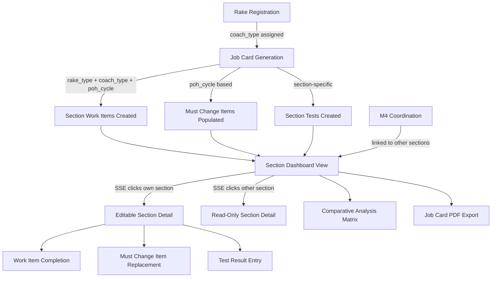
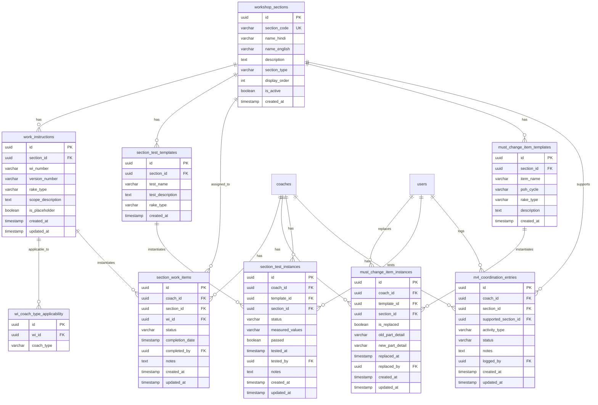

# Design Document: जॉब कार्ड सेक्शन एनालिसिस (Job Card Section Analysis)

## Overview

यह फीचर Railway POH Management System में **सेक्शन-वार जॉब कार्ड** की पूरी कार्यक्षमता जोड़ता है। वर्तमान सिस्टम में कोच-लेवल स्टेज ट्रैकिंग (8 sequential stages) है, लेकिन वर्कशॉप फ्लोर पर काम 10 सेक्शन्स (M5, M6, M8, E2, E3, E5, M2, M3, Painting, M4) में बँटा होता है। यह design document इन 10 सेक्शन्स के लिए Work Instructions, Must Change Items, Testing Formats, Section Dashboard, Comparative Analysis, और SSE-based access control को कवर करता है।

### मुख्य Design Decisions

1. **Additive Schema**: Existing `coaches`, `rakes` tables को modify नहीं करेंगे — नई tables (`workshop_sections`, `work_instructions`, `must_change_items`, `section_work_items`, `section_tests`, `m4_coordination_entries`) add करेंगे। `coaches` table में `coach_type` column `poh-architecture-changes` spec से आएगा।
2. **Template-Instance Pattern**: Work Instructions और Must Change Items को templates के रूप में store करेंगे, और Job Card generation के समय coach-specific instances बनाएँगे।
3. **Section-Based RLS**: SSE को अपने assigned section का data edit करने की permission RLS policies + Server Action checks दोनों से enforce होगी।
4. **M4 as Coordination Section**: M4 के अपने work items नहीं होंगे — यह अन्य sections को support करने वाली coordination entries track करेगा।
5. **Painting as Placeholder**: Painting section की WI entries placeholder होंगी जो बाद में update की जा सकती हैं।
6. **PDF Generation**: Job Card export के लिए server-side PDF generation (`@react-pdf/renderer` या `jspdf`) का उपयोग होगा।

### Technology Stack (Additions)

- **PDF Export**: `jspdf` + `jspdf-autotable` for server-side PDF generation
- **Existing Stack**: Next.js 14+ (App Router), Supabase (PostgreSQL + RLS), Tailwind CSS, Zod, Server Actions


## Architecture

### High-Level Data Flow



### Component Architecture

```
app/(dashboard)/
├── rakes/[rakeId]/
│   ├── section-analysis/page.tsx          ← Comparative Analysis Matrix (Req 16)
│   └── coaches/[coachId]/
│       ├── sections/page.tsx              ← Section Dashboard (Req 15)
│       └── sections/[sectionCode]/page.tsx ← Section Detail View (Req 2-11)
```

### Data Flow Patterns

#### Job Card Generation (Rake Registration Time)
```
Rake Created → For each Coach:
  1. Determine coach_type (MC/TC/DTC/DMC/NDTC)
  2. Determine rake_type (Conventional/3-Phase)
  3. Determine poh_cycle (1st/2nd/3rd/4th)
  4. For each of 10 sections:
     a. Check if section is applicable to this coach_type
     b. If applicable: create section_work_items from work_instructions
     c. Populate must_change_items based on poh_cycle
     d. Create section_test entries
```

#### SSE Access Control Flow
```
SSE Login → Get assigned section from user_section_assignments
  → Section Dashboard: All 10 sections visible (read-only)
  → Own Section: Full edit access (work items, must change, tests, notes)
  → Other Sections: Read-only (all edit controls disabled)
  → API/Server Action: Verify section assignment before mutation
```


## Components and Interfaces

### New Page Components

#### 1. SectionDashboard (`sections/page.tsx`) — Server Component
```typescript
// Coach detail page पर Section Dashboard (Req 15)
interface SectionDashboardProps {
  coachId: string;
}
// Displays: 10 section cards in grid, each showing:
// - Section code + name (Hindi/English)
// - Progress percentage (color-coded)
// - Work items: total/completed
// - Must Change Items: total/replaced
// - Testing status
// - SSE's own section highlighted with distinct border
// Aggregate job card completion % at top
// Coach_Type and Rake_Type in header
```

#### 2. SectionDetailView (`sections/[sectionCode]/page.tsx`) — Server Component
```typescript
interface SectionDetailViewProps {
  coachId: string;
  sectionCode: string; // M5, M6, M8, E2, E3, E5, M2, M3, Painting, M4
}
// Tabs: Work Instructions | Must Change Items | Testing | Notes
// Editable if SSE's assigned section, read-only otherwise
// Shows WI number, VERSION, applicable Rake_Type, Coach_Types
// POH_Cycle number prominently displayed
```

#### 3. SectionAnalysisMatrix (`section-analysis/page.tsx`) — Server Component
```typescript
interface SectionAnalysisMatrixProps {
  rakeId: string;
}
// Matrix: coaches (rows) × sections (columns)
// Each cell: progress %, color-coded
// N/A for non-applicable sections
// Average row at bottom
// Warning indicator for sections < 50% average
// Clickable cells → navigate to section detail
```


#### 4. Client Components

```typescript
// SectionCard — individual section card on dashboard
interface SectionCardProps {
  section: {
    sectionCode: string;
    nameHindi: string;
    nameEnglish: string;
    progress: number;
    totalWorkItems: number;
    completedWorkItems: number;
    mustChangeTotal: number;
    mustChangeReplaced: number;
    testingStatus: 'Not Started' | 'In Progress' | 'Completed' | 'Failed';
    isAssignedToCurrentSSE: boolean;
  };
  coachId: string;
  isEditable: boolean;
}

// WorkItemList — work items within a section
interface WorkItemListProps {
  items: SectionWorkItem[];
  isEditable: boolean;
  onStatusUpdate: (itemId: string, status: string) => void;
}

// MustChangeChecklist — must change items checklist
interface MustChangeChecklistProps {
  items: MustChangeItemInstance[];
  isEditable: boolean;
  onReplace: (itemId: string, oldPartDetail: string, newPartDetail: string) => void;
}

// SectionTestPanel — section-specific tests
interface SectionTestPanelProps {
  tests: SectionTestInstance[];
  isEditable: boolean;
  onTestResult: (testId: string, result: TestResultInput) => void;
}

// M4CoordinationPanel — M4 coordination entries
interface M4CoordinationPanelProps {
  entries: M4CoordinationEntry[];
  isEditable: boolean;
  onAddEntry: (entry: M4CoordinationInput) => void;
}

// JobCardExportButton — PDF export trigger
interface JobCardExportButtonProps {
  coachId: string;
}
```

### Server Actions (New)

```typescript
// Section Work Items
'use server';
export async function updateSectionWorkItemStatus(
  itemId: string, status: 'Not Started' | 'In Progress' | 'Completed'
): Promise<Result<void>>;

// Must Change Items
export async function replaceMustChangeItem(
  itemId: string, oldPartDetail: string, newPartDetail: string
): Promise<Result<void>>;

// Section Tests
export async function recordSectionTestResult(
  testId: string, measuredValues: string, passed: boolean, notes?: string
): Promise<Result<void>>;

// Section Completion
export async function completeSectionForCoach(
  coachId: string, sectionCode: string
): Promise<Result<void>>;

// M4 Coordination
export async function addM4CoordinationEntry(
  coachId: string, activityType: string, supportedSection: string, notes?: string
): Promise<Result<void>>;

// Job Card Generation (called during rake registration)
export async function generateJobCardForCoach(
  coachId: string, rakeType: string, coachType: string, pohCycle: string
): Promise<Result<void>>;

// Job Card PDF Export
export async function exportJobCardPDF(coachId: string): Promise<Result<Blob>>;
```

### Query Functions (New)

```typescript
// Section Dashboard data
export async function getCoachSectionDashboard(coachId: string): Promise<SectionDashboardData>;

// Section Detail data
export async function getSectionDetail(
  coachId: string, sectionCode: string
): Promise<SectionDetailData>;

// Comparative Analysis Matrix
export async function getRakeSectionAnalysis(rakeId: string): Promise<SectionAnalysisData>;

// SSE section assignment check
export async function getUserAssignedSection(userId: string): Promise<string | null>;
```


## Data Models

### Entity Relationship Diagram




### Table Definitions

#### workshop_sections (Master Table — 10 Fixed Sections)
```sql
CREATE TABLE workshop_sections (
  id UUID PRIMARY KEY DEFAULT gen_random_uuid(),
  section_code VARCHAR(20) UNIQUE NOT NULL CHECK (
    section_code IN ('M5', 'M6', 'M8', 'E2', 'E3', 'E5', 'M2', 'M3', 'Painting', 'M4')
  ),
  name_hindi VARCHAR(200) NOT NULL,
  name_english VARCHAR(200) NOT NULL,
  description TEXT,
  section_type VARCHAR(20) NOT NULL DEFAULT 'standard' CHECK (
    section_type IN ('standard', 'placeholder', 'coordination')
  ),
  display_order INT NOT NULL,
  is_active BOOLEAN DEFAULT true,
  created_at TIMESTAMPTZ DEFAULT NOW()
);

CREATE INDEX idx_ws_code ON workshop_sections(section_code);
CREATE INDEX idx_ws_order ON workshop_sections(display_order);
```

#### work_instructions (WI Templates per Section)
```sql
CREATE TABLE work_instructions (
  id UUID PRIMARY KEY DEFAULT gen_random_uuid(),
  section_id UUID NOT NULL REFERENCES workshop_sections(id) ON DELETE CASCADE,
  wi_number VARCHAR(20) NOT NULL,
  version_number VARCHAR(10) NOT NULL DEFAULT '01',
  rake_type VARCHAR(30) NOT NULL CHECK (
    rake_type IN ('Conventional', '3-Phase')
  ),
  scope_description TEXT,
  is_placeholder BOOLEAN DEFAULT false,
  created_at TIMESTAMPTZ DEFAULT NOW(),
  updated_at TIMESTAMPTZ DEFAULT NOW(),
  UNIQUE(wi_number, version_number, rake_type)
);

CREATE INDEX idx_wi_section ON work_instructions(section_id);
CREATE INDEX idx_wi_rake_type ON work_instructions(rake_type);
```

#### wi_coach_type_applicability (WI ↔ Coach Type Mapping)
```sql
CREATE TABLE wi_coach_type_applicability (
  id UUID PRIMARY KEY DEFAULT gen_random_uuid(),
  wi_id UUID NOT NULL REFERENCES work_instructions(id) ON DELETE CASCADE,
  coach_type VARCHAR(10) NOT NULL CHECK (
    coach_type IN ('MC', 'TC', 'DTC', 'DMC', 'NDTC')
  ),
  UNIQUE(wi_id, coach_type)
);

CREATE INDEX idx_wica_wi ON wi_coach_type_applicability(wi_id);
CREATE INDEX idx_wica_coach_type ON wi_coach_type_applicability(coach_type);
```


#### must_change_item_templates (POH Cycle-Based Must Change Items)
```sql
CREATE TABLE must_change_item_templates (
  id UUID PRIMARY KEY DEFAULT gen_random_uuid(),
  section_id UUID NOT NULL REFERENCES workshop_sections(id) ON DELETE CASCADE,
  item_name VARCHAR(200) NOT NULL,
  poh_cycle VARCHAR(10) NOT NULL CHECK (
    poh_cycle IN ('1st POH', '2nd POH', '3rd POH', '4th POH')
  ),
  rake_type VARCHAR(30) NOT NULL CHECK (
    rake_type IN ('Conventional', '3-Phase')
  ),
  description TEXT,
  created_at TIMESTAMPTZ DEFAULT NOW(),
  UNIQUE(section_id, item_name, poh_cycle, rake_type)
);

CREATE INDEX idx_mci_section ON must_change_item_templates(section_id);
CREATE INDEX idx_mci_cycle ON must_change_item_templates(poh_cycle);
```

#### section_test_templates (Section-Specific Test Definitions)
```sql
CREATE TABLE section_test_templates (
  id UUID PRIMARY KEY DEFAULT gen_random_uuid(),
  section_id UUID NOT NULL REFERENCES workshop_sections(id) ON DELETE CASCADE,
  test_name VARCHAR(200) NOT NULL,
  test_description TEXT,
  rake_type VARCHAR(30) CHECK (
    rake_type IN ('Conventional', '3-Phase', NULL)
  ),
  created_at TIMESTAMPTZ DEFAULT NOW(),
  UNIQUE(section_id, test_name, rake_type)
);

CREATE INDEX idx_stt_section ON section_test_templates(section_id);
```

#### section_work_items (Coach-Specific Work Item Instances)
```sql
CREATE TABLE section_work_items (
  id UUID PRIMARY KEY DEFAULT gen_random_uuid(),
  coach_id UUID NOT NULL REFERENCES coaches(id) ON DELETE CASCADE,
  section_id UUID NOT NULL REFERENCES workshop_sections(id) ON DELETE RESTRICT,
  wi_id UUID NOT NULL REFERENCES work_instructions(id) ON DELETE RESTRICT,
  status VARCHAR(20) NOT NULL DEFAULT 'Not Started' CHECK (
    status IN ('Not Started', 'In Progress', 'Completed')
  ),
  completion_date TIMESTAMPTZ,
  completed_by UUID REFERENCES users(id) ON DELETE SET NULL,
  notes TEXT,
  created_at TIMESTAMPTZ DEFAULT NOW(),
  updated_at TIMESTAMPTZ DEFAULT NOW(),
  UNIQUE(coach_id, wi_id)
);

CREATE INDEX idx_swi_coach ON section_work_items(coach_id);
CREATE INDEX idx_swi_section ON section_work_items(section_id);
CREATE INDEX idx_swi_status ON section_work_items(status);
CREATE INDEX idx_swi_coach_section ON section_work_items(coach_id, section_id);
```


#### must_change_item_instances (Coach-Specific Must Change Item Tracking)
```sql
CREATE TABLE must_change_item_instances (
  id UUID PRIMARY KEY DEFAULT gen_random_uuid(),
  coach_id UUID NOT NULL REFERENCES coaches(id) ON DELETE CASCADE,
  template_id UUID NOT NULL REFERENCES must_change_item_templates(id) ON DELETE RESTRICT,
  section_id UUID NOT NULL REFERENCES workshop_sections(id) ON DELETE RESTRICT,
  is_replaced BOOLEAN NOT NULL DEFAULT false,
  old_part_detail VARCHAR(500),
  new_part_detail VARCHAR(500),
  replaced_at TIMESTAMPTZ,
  replaced_by UUID REFERENCES users(id) ON DELETE SET NULL,
  created_at TIMESTAMPTZ DEFAULT NOW(),
  updated_at TIMESTAMPTZ DEFAULT NOW(),
  UNIQUE(coach_id, template_id)
);

CREATE INDEX idx_mcii_coach ON must_change_item_instances(coach_id);
CREATE INDEX idx_mcii_section ON must_change_item_instances(section_id);
CREATE INDEX idx_mcii_replaced ON must_change_item_instances(is_replaced);
CREATE INDEX idx_mcii_coach_section ON must_change_item_instances(coach_id, section_id);
```

#### section_test_instances (Coach-Specific Test Results)
```sql
CREATE TABLE section_test_instances (
  id UUID PRIMARY KEY DEFAULT gen_random_uuid(),
  coach_id UUID NOT NULL REFERENCES coaches(id) ON DELETE CASCADE,
  template_id UUID NOT NULL REFERENCES section_test_templates(id) ON DELETE RESTRICT,
  section_id UUID NOT NULL REFERENCES workshop_sections(id) ON DELETE RESTRICT,
  status VARCHAR(20) NOT NULL DEFAULT 'Not Started' CHECK (
    status IN ('Not Started', 'In Progress', 'Completed', 'Failed')
  ),
  measured_values TEXT,
  passed BOOLEAN,
  tested_at TIMESTAMPTZ,
  tested_by UUID REFERENCES users(id) ON DELETE SET NULL,
  notes TEXT,
  created_at TIMESTAMPTZ DEFAULT NOW(),
  updated_at TIMESTAMPTZ DEFAULT NOW(),
  UNIQUE(coach_id, template_id)
);

CREATE INDEX idx_sti_coach ON section_test_instances(coach_id);
CREATE INDEX idx_sti_section ON section_test_instances(section_id);
CREATE INDEX idx_sti_status ON section_test_instances(status);
CREATE INDEX idx_sti_coach_section ON section_test_instances(coach_id, section_id);
```


#### m4_coordination_entries (M4 Support/Coordination Tracking)
```sql
CREATE TABLE m4_coordination_entries (
  id UUID PRIMARY KEY DEFAULT gen_random_uuid(),
  coach_id UUID NOT NULL REFERENCES coaches(id) ON DELETE CASCADE,
  section_id UUID NOT NULL REFERENCES workshop_sections(id) ON DELETE RESTRICT,
  supported_section_id UUID NOT NULL REFERENCES workshop_sections(id) ON DELETE RESTRICT,
  activity_type VARCHAR(50) NOT NULL CHECK (
    activity_type IN ('Lifting', 'Lowering', 'Shifting', 'Crane Operation', 'Other')
  ),
  status VARCHAR(20) NOT NULL DEFAULT 'Pending' CHECK (
    status IN ('Pending', 'In Progress', 'Completed')
  ),
  notes TEXT,
  logged_by UUID REFERENCES users(id) ON DELETE SET NULL,
  created_at TIMESTAMPTZ DEFAULT NOW(),
  updated_at TIMESTAMPTZ DEFAULT NOW()
);

CREATE INDEX idx_m4ce_coach ON m4_coordination_entries(coach_id);
CREATE INDEX idx_m4ce_supported ON m4_coordination_entries(supported_section_id);
CREATE INDEX idx_m4ce_status ON m4_coordination_entries(status);
```

### Section ↔ Coach Type Applicability Matrix

यह matrix define करता है कि कौन सा section किस coach type पर applicable है:

| Section | MC | TC | DTC | DMC | NDTC | Notes |
|---------|----|----|-----|-----|------|-------|
| M5      | ✓  | ✓  | ✓   | ✓   | ✓    | All coach types |
| M6      | ✓  | ✓  | ✓   | ✓   | ✓    | All coach types |
| M8      | ✓  | ✗  | ✗   | ✗   | ✗    | MC only (compressor) |
| E2      | ✓  | ✓  | ✓   | ✓   | ✗    | No NDTC |
| E3      | ✓  | ✗  | ✗   | ✓   | ✗    | Motor coaches only |
| E5      | ✓  | ✓  | ✓   | ✓   | ✓    | All coach types |
| M2      | ✓  | ✓  | ✓   | ✓   | ✓    | All coach types |
| M3      | ✓  | ✓  | ✓   | ✓   | ✓    | Pantograph: MC/DMC only; Speedometer: all |
| Painting| ✓  | ✓  | ✓   | ✓   | ✓    | All coach types |
| M4      | ✓  | ✓  | ✓   | ✓   | ✓    | Cross-cutting support |

### Section-wise Work Instructions Mapping

| Section | Conventional WIs | 3-Phase WIs |
|---------|-----------------|-------------|
| M5      | W/M5/01 - W/M5/05 | W/M5/01 - W/M5/05 (3P variants) |
| M6      | W/M6/01, W/M6/02 | W/M6/01, W/M6/02 (3P variants) |
| M8      | W/M8/01, W/M8/02 | W/M8/01, W/M8/02 (3P variants) |
| E2      | W/E2/05, W/E2/06 | W/E2/05, W/E2/06 (3P variants) |
| E3      | W/E3/05, W/E3/06 | W/E3/05, W/E3/06 (3P variants) |
| E5      | W/E5/05, W/E5/06 | W/E5/05, W/E5/06 (3P variants) |
| M2      | W/M2/01, W/M2/02 | W/M2/01, W/M2/02 (3P variants) |
| M3      | W/M3/07, W/M3/08 | W/M3/07, W/M3/08 (3P variants) |
| Painting| Placeholder | Placeholder |
| M4      | N/A (coordination) | N/A (coordination) |


### Database Functions

#### Job Card Generation Function
```sql
CREATE OR REPLACE FUNCTION generate_job_card(
  p_coach_id UUID,
  p_rake_type VARCHAR,
  p_coach_type VARCHAR,
  p_poh_cycle VARCHAR
) RETURNS VOID AS $$
DECLARE
  v_section RECORD;
  v_wi RECORD;
  v_mci RECORD;
  v_test RECORD;
  v_rake_type_mapped VARCHAR;
BEGIN
  -- Map rake_type to WI variant
  v_rake_type_mapped := CASE
    WHEN p_rake_type IN ('3-Phase Rake', '3-Phase') THEN '3-Phase'
    ELSE 'Conventional'
  END;

  -- For each applicable section
  FOR v_section IN
    SELECT ws.id, ws.section_code, ws.section_type
    FROM workshop_sections ws
    WHERE ws.is_active = true
  LOOP
    -- Skip M4 coordination section for work items
    IF v_section.section_type = 'coordination' THEN
      CONTINUE;
    END IF;

    -- Create work items from applicable WIs
    FOR v_wi IN
      SELECT wi.id
      FROM work_instructions wi
      JOIN wi_coach_type_applicability wica ON wica.wi_id = wi.id
      WHERE wi.section_id = v_section.id
        AND wi.rake_type = v_rake_type_mapped
        AND wica.coach_type = p_coach_type
    LOOP
      INSERT INTO section_work_items (coach_id, section_id, wi_id)
      VALUES (p_coach_id, v_section.id, v_wi.id)
      ON CONFLICT (coach_id, wi_id) DO NOTHING;
    END LOOP;

    -- Create must change item instances
    FOR v_mci IN
      SELECT mci.id
      FROM must_change_item_templates mci
      WHERE mci.section_id = v_section.id
        AND mci.poh_cycle = p_poh_cycle
        AND mci.rake_type = v_rake_type_mapped
    LOOP
      INSERT INTO must_change_item_instances (coach_id, template_id, section_id)
      VALUES (p_coach_id, v_mci.id, v_section.id)
      ON CONFLICT (coach_id, template_id) DO NOTHING;
    END LOOP;

    -- Create test instances
    FOR v_test IN
      SELECT st.id
      FROM section_test_templates st
      WHERE st.section_id = v_section.id
        AND (st.rake_type = v_rake_type_mapped OR st.rake_type IS NULL)
    LOOP
      INSERT INTO section_test_instances (coach_id, template_id, section_id)
      VALUES (p_coach_id, v_test.id, v_section.id)
      ON CONFLICT (coach_id, template_id) DO NOTHING;
    END LOOP;
  END LOOP;
END;
$$ LANGUAGE plpgsql;
```

#### Section Progress Calculation View
```sql
CREATE OR REPLACE VIEW v_coach_section_progress AS
SELECT
  swi.coach_id,
  swi.section_id,
  ws.section_code,
  ws.name_hindi,
  ws.name_english,
  ws.section_type,
  COUNT(swi.id) AS total_work_items,
  COUNT(swi.id) FILTER (WHERE swi.status = 'Completed') AS completed_work_items,
  CASE
    WHEN COUNT(swi.id) = 0 THEN 0
    ELSE ROUND((COUNT(swi.id) FILTER (WHERE swi.status = 'Completed')::NUMERIC / COUNT(swi.id)) * 100)
  END AS progress_pct,
  (SELECT COUNT(*) FROM must_change_item_instances mci
   WHERE mci.coach_id = swi.coach_id AND mci.section_id = swi.section_id) AS must_change_total,
  (SELECT COUNT(*) FROM must_change_item_instances mci
   WHERE mci.coach_id = swi.coach_id AND mci.section_id = swi.section_id AND mci.is_replaced = true) AS must_change_replaced,
  (SELECT COUNT(*) FROM section_test_instances sti
   WHERE sti.coach_id = swi.coach_id AND sti.section_id = swi.section_id) AS tests_total,
  (SELECT COUNT(*) FROM section_test_instances sti
   WHERE sti.coach_id = swi.coach_id AND sti.section_id = swi.section_id AND sti.status = 'Completed' AND sti.passed = true) AS tests_passed,
  (SELECT COUNT(*) FROM section_test_instances sti
   WHERE sti.coach_id = swi.coach_id AND sti.section_id = swi.section_id AND sti.status = 'Failed') AS tests_failed
FROM section_work_items swi
JOIN workshop_sections ws ON ws.id = swi.section_id
GROUP BY swi.coach_id, swi.section_id, ws.section_code, ws.name_hindi, ws.name_english, ws.section_type;
```


### RLS Policies for Section-Based Access

```sql
-- Section Work Items: SSE can only update their assigned section
ALTER TABLE section_work_items ENABLE ROW LEVEL SECURITY;

CREATE POLICY "Anyone can view section work items"
  ON section_work_items FOR SELECT TO authenticated
  USING (true);

CREATE POLICY "SSE can update own section work items"
  ON section_work_items FOR UPDATE TO authenticated
  USING (
    is_admin()
    OR EXISTS (
      SELECT 1 FROM user_section_assignments usa
      JOIN workshop_sections ws ON ws.section_code = usa.sub_section
      WHERE usa.user_id = auth.uid()
        AND ws.id = section_work_items.section_id
    )
  );

-- Must Change Item Instances: Same pattern
ALTER TABLE must_change_item_instances ENABLE ROW LEVEL SECURITY;

CREATE POLICY "Anyone can view must change items"
  ON must_change_item_instances FOR SELECT TO authenticated
  USING (true);

CREATE POLICY "SSE can update own section must change items"
  ON must_change_item_instances FOR UPDATE TO authenticated
  USING (
    is_admin()
    OR EXISTS (
      SELECT 1 FROM user_section_assignments usa
      JOIN workshop_sections ws ON ws.section_code = usa.sub_section
      WHERE usa.user_id = auth.uid()
        AND ws.id = must_change_item_instances.section_id
    )
  );

-- Section Test Instances: Same pattern
ALTER TABLE section_test_instances ENABLE ROW LEVEL SECURITY;

CREATE POLICY "Anyone can view section tests"
  ON section_test_instances FOR SELECT TO authenticated
  USING (true);

CREATE POLICY "SSE can update own section tests"
  ON section_test_instances FOR UPDATE TO authenticated
  USING (
    is_admin()
    OR EXISTS (
      SELECT 1 FROM user_section_assignments usa
      JOIN workshop_sections ws ON ws.section_code = usa.sub_section
      WHERE usa.user_id = auth.uid()
        AND ws.id = section_test_instances.section_id
    )
  );

-- M4 Coordination Entries
ALTER TABLE m4_coordination_entries ENABLE ROW LEVEL SECURITY;

CREATE POLICY "Anyone can view M4 entries"
  ON m4_coordination_entries FOR SELECT TO authenticated
  USING (true);

CREATE POLICY "M4 SSE can manage coordination entries"
  ON m4_coordination_entries FOR ALL TO authenticated
  USING (
    is_admin()
    OR EXISTS (
      SELECT 1 FROM user_section_assignments usa
      WHERE usa.user_id = auth.uid()
        AND usa.sub_section = 'M4'
    )
  );
```

### Seed Data: Workshop Sections

```sql
INSERT INTO workshop_sections (section_code, name_hindi, name_english, description, section_type, display_order) VALUES
('M2', 'फर्निशिंग और बॉडी सेक्शन', 'Furnishing & Body Section', 'Body repair, furnishing, seat, window, door, flooring, roof', 'standard', 1),
('M3', 'पैंटोग्राफ और स्पीडोमीटर सेक्शन', 'Pantograph & Speedometer Section', 'Pantograph overhaul, speedometer, speed recorder, carbon strip', 'standard', 2),
('M4', 'M&P / मशीनरी सेक्शन', 'M&P / Machinery Section', 'Lifting jack, crane, M&P equipment coordination, support to all sections', 'coordination', 3),
('M5', 'ब्रेक/न्यूमैटिक सेक्शन', 'Brake/Pneumatic Section', 'Brake system, pneumatic equipment, distributor valve, brake cylinder, slack adjuster, air dryer, MU valve, angle cock, hose pipe', 'standard', 4),
('M6', 'बोगी और मैकेनिकल सेक्शन', 'Bogie & Mechanical Section', 'Bogie overhaul, bolster spring, axle box, center pivot, side bearer, wheel set, axle, bearing', 'standard', 5),
('M8', 'कम्प्रेसर सेक्शन', 'Compressor Section', 'Compressor overhaul, motor overhaul, unloader valve, safety valve, NRV', 'standard', 6),
('Painting', 'पेंटिंग सेक्शन', 'Painting Section', 'Surface preparation, primer, putty, final coat, livery marking', 'placeholder', 7),
('E2', 'HT इलेक्ट्रिकल सेक्शन', 'HT Electrical Section', 'HT equipment, transformer, tap changer, HT cable, circuit breaker, lightning arrester', 'standard', 8),
('E3', 'ट्रैक्शन मोटर सेक्शन', 'Traction Motor Section', 'Traction motor overhaul, armature, field coil, brush gear, bearing, gear case', 'standard', 9),
('E5', 'ट्रेन लाइटिंग और LT इलेक्ट्रिकल सेक्शन', 'Train Lighting & LT Electrical Section', 'Train lighting, battery, charger, LT wiring, fan, destination board, PA system, CCTV', 'standard', 10);
```

### TypeScript Types (New)

```typescript
// Section-related types
export type SectionCode = 'M5' | 'M6' | 'M8' | 'E2' | 'E3' | 'E5' | 'M2' | 'M3' | 'Painting' | 'M4';
export type CoachType = 'MC' | 'TC' | 'DTC' | 'DMC' | 'NDTC';
export type SectionType = 'standard' | 'placeholder' | 'coordination';
export type WorkItemStatus = 'Not Started' | 'In Progress' | 'Completed';
export type SectionTestStatus = 'Not Started' | 'In Progress' | 'Completed' | 'Failed';
export type M4ActivityType = 'Lifting' | 'Lowering' | 'Shifting' | 'Crane Operation' | 'Other';

export interface WorkshopSection {
  id: string;
  sectionCode: SectionCode;
  nameHindi: string;
  nameEnglish: string;
  description: string;
  sectionType: SectionType;
  displayOrder: number;
}

export interface SectionProgressSummary {
  sectionCode: SectionCode;
  nameHindi: string;
  nameEnglish: string;
  sectionType: SectionType;
  progressPct: number;
  totalWorkItems: number;
  completedWorkItems: number;
  mustChangeTotal: number;
  mustChangeReplaced: number;
  testsTotal: number;
  testsPassed: number;
  testsFailed: number;
  isApplicable: boolean;
}

export interface SectionDashboardData {
  coachId: string;
  coachNumber: string;
  coachType: CoachType;
  rakeType: string;
  pohCycle: string;
  sections: SectionProgressSummary[];
  aggregateCompletionPct: number;
}

export interface SectionAnalysisData {
  rakeId: string;
  rakeNumber: string;
  coaches: {
    coachId: string;
    coachNumber: string;
    coachType: CoachType;
    sections: Record<SectionCode, { progressPct: number; isApplicable: boolean }>;
  }[];
  averages: Record<SectionCode, number>;
}
```


## Correctness Properties

*A property is a characteristic or behavior that should hold true across all valid executions of a system — essentially, a formal statement about what the system should do. Properties serve as the bridge between human-readable specifications and machine-verifiable correctness guarantees.*

### Property 1: Job Card Generation Assigns Correct Sections per Coach Type

*For any* coach with a given `coach_type` (MC/TC/DTC/DMC/NDTC), when a job card is generated, the set of assigned workshop sections must exactly match the applicability matrix — no extra sections, no missing sections. For example, an MC coach should get all 10 sections, while a TC coach should not get M8 or E3.

**Validates: Requirements 1.3, 18.1**

### Property 2: Work Instruction Filtering by Rake Type and Coach Type

*For any* coach with a given `rake_type` and `coach_type`, the work instructions displayed for each section must only include WIs that match both the rake type variant (Conventional/3-Phase) and the coach type applicability. No WI should appear that doesn't match the coach's type, and no applicable WI should be missing.

**Validates: Requirements 1.4, 12.2, 12.3, 12.5, 18.2**

### Property 3: Must Change Items Populated Correctly by POH Cycle

*For any* coach with a given `poh_cycle` (1st/2nd/3rd/4th POH) and `rake_type`, the must change item instances generated for each section must exactly match the templates defined for that POH cycle and rake type combination. Different POH cycles must produce different must change item sets where the templates differ.

**Validates: Requirements 13.1, 13.2**

### Property 4: Section Completion Blocked by Unreplaced Must Change Items or Failed Tests

*For any* workshop section on any coach, if there exists at least one unreplaced must change item OR at least one failed/incomplete mandatory test, then attempting to mark the section as "Completed" must be rejected with a validation error. Conversely, if all must change items are replaced AND all tests pass, completion must succeed.

**Validates: Requirements 13.5, 14.4, 18.3**

### Property 5: WI Version Update Immutability

*For any* existing job card instance, when a work instruction template's version number is updated, the existing `section_work_items` records must remain unchanged — they should still reference the original WI version. Only newly generated job cards should use the updated version.

**Validates: Requirements 12.4, 10.7**


### Property 6: SSE Section-Based Access Control Enforcement

*For any* Senior_Section_Engineer with an assigned section S, and *for any* data mutation (work item update, must change item replacement, test result entry, note addition) targeting a section T where T ≠ S, the system must reject the mutation with an authorization error. Conversely, mutations targeting section S must be allowed.

**Validates: Requirements 15.6, 15.7, 19.5, 19.6, 19.7, 19.10**

### Property 7: Section Progress Calculation Invariant

*For any* workshop section on any coach, the `progress_pct` must always equal `floor(completed_work_items / total_work_items * 100)` when `total_work_items > 0`, and 0 when `total_work_items = 0`. The value must always be in the range [0, 100].

**Validates: Requirements 18.5, 18.6**

### Property 8: M4 Has No Independent Work Items

*For any* job card generation, the M4 (coordination) section must have zero `section_work_items` records. M4's status must be derived solely from its `m4_coordination_entries` completion status.

**Validates: Requirements 11.4, 11.5, 11.6**

### Property 9: Section Dashboard Color Coding Consistency

*For any* section progress value, the color code must follow: grey for "Not Started" (0% and no items in progress), yellow for progress ≤ 50% with at least one item in progress, blue for progress > 50% but not complete, and green for "Completed" (100% work items + all must change items replaced + all tests passed). The color assignment must be a pure function of the progress state.

**Validates: Requirements 15.3**

### Property 10: Comparative Analysis Matrix N/A Correctness

*For any* coach in a rake and *for any* section, the matrix cell must show "N/A" if and only if the section is not applicable to that coach's `coach_type` according to the applicability matrix. The average calculation for each section must exclude N/A coaches.

**Validates: Requirements 16.2, 16.3, 16.4, 16.5**

### Property 11: Data Recording Completeness on Mutations

*For any* must change item replacement, the system must record a non-null `replaced_at` timestamp, `replaced_by` user ID, `old_part_detail`, and `new_part_detail`. *For any* test result recording, the system must record a non-null `tested_at` timestamp, `tested_by` user ID, `measured_values`, and `passed` boolean.

**Validates: Requirements 13.4, 14.3**

### Property 12: Job Card PDF Contains All Required Sections in Order

*For any* coach, the exported PDF must contain sections ordered as (M2, M3, M4, M5, M6, M8, Painting, E2, E3, E5), include only applicable sections, and each section must contain its work items, must change items status, and test results. The header must contain coach number, rake number, coach_type, rake_type, poh_cycle, shed name, and generation timestamp.

**Validates: Requirements 17.2, 17.3, 17.4, 17.6**

### Property 13: Section Deletion Prevention on Active Job Cards

*For any* active job card (where the rake status is 'Active'), attempting to delete a workshop section assignment must fail. The system must not allow removal of sections from in-progress job cards.

**Validates: Requirements 18.4**

### Property 14: SSE Assignment Requires Exactly One Section

*For any* user creation or update with the Senior_Section_Engineer role, the system must require exactly one workshop section assignment. Zero sections or more than one section must be rejected. After an admin updates the assignment, the new section must be returned on the next query.

**Validates: Requirements 19.1, 19.2, 19.9**


## Error Handling

### Validation Errors

| Scenario | Error Message (Hindi/English) | Action |
|----------|-------------------------------|--------|
| Section completion with unreplaced must change items | "सेक्शन पूर्ण नहीं हो सकता: {count} Must Change Items बाकी हैं" / "Cannot complete section: {count} Must Change Items pending" | Block completion, list pending items |
| Section completion with failed tests | "सेक्शन पूर्ण नहीं हो सकता: {count} टेस्ट फेल हैं" / "Cannot complete section: {count} tests failed" | Block completion, list failed tests |
| SSE editing non-assigned section | "आपको इस सेक्शन में बदलाव करने की अनुमति नहीं है" / "You are not authorized to edit this section" | Return 403, disable edit controls |
| Invalid coach_type for section | "यह सेक्शन इस कोच टाइप पर लागू नहीं है" / "This section is not applicable to this coach type" | Show N/A, skip in job card generation |
| Duplicate job card generation | "इस कोच के लिए जॉब कार्ड पहले से मौजूद है" / "Job card already exists for this coach" | ON CONFLICT DO NOTHING in DB |
| Progress value out of range | Auto-recalculate from work items | Log warning, recalculate |
| Section deletion attempt on active job card | "सक्रिय जॉब कार्ड से सेक्शन हटाया नहीं जा सकता" / "Cannot delete section from active job card" | Block deletion |
| Missing required fields on must change item replacement | "पुराने और नए पार्ट की जानकारी आवश्यक है" / "Old and new part details are required" | Block save, highlight fields |

### Error Handling Strategy

1. **Server Actions**: सभी mutations `Result<T>` type return करेंगे — `{ success: true, data }` या `{ success: false, error }`. Client side पर toast notification दिखाएँगे।
2. **RLS Failures**: Supabase RLS policy violations को gracefully handle करेंगे — unauthorized mutations silently fail at DB level, Server Action layer पर explicit check करके user-friendly error दिखाएँगे।
3. **Optimistic Updates**: Work item status changes optimistic update करेंगे, failure पर rollback with toast।
4. **PDF Generation Errors**: PDF generation failure पर retry option with error message।
5. **Data Integrity**: Database constraints (CHECK, UNIQUE, FK) violations को catch करके meaningful error messages में translate करेंगे।


## Testing Strategy

### Dual Testing Approach

इस फीचर के लिए **unit tests** और **property-based tests** दोनों का उपयोग होगा। Unit tests specific examples और edge cases cover करेंगे, जबकि property-based tests universal properties verify करेंगे across randomized inputs।

### Property-Based Testing Configuration

- **Library**: `fast-check` (TypeScript/JavaScript PBT library)
- **Minimum Iterations**: 100 per property test
- **Tag Format**: `Feature: job-card-section-analysis, Property {number}: {property_text}`
- **Each correctness property will be implemented by a SINGLE property-based test**

### Property Tests

| Property | Test Description | Generator Strategy |
|----------|-----------------|-------------------|
| Property 1 | Job card generation assigns correct sections | Generate random `coach_type` values, verify section assignment against applicability matrix |
| Property 2 | WI filtering by rake_type and coach_type | Generate random `(rake_type, coach_type)` pairs, verify WI list correctness |
| Property 3 | Must change items by POH cycle | Generate random `(poh_cycle, rake_type)` pairs, verify must change item population |
| Property 4 | Section completion validation | Generate random section states (some with unreplaced items/failed tests), verify completion blocking |
| Property 5 | WI version immutability | Generate job cards, update WI versions, verify existing instances unchanged |
| Property 6 | SSE access control | Generate random `(sse_section, target_section)` pairs, verify allow/deny |
| Property 7 | Progress calculation | Generate random work item status arrays, verify progress = completed/total * 100 |
| Property 8 | M4 no work items | Generate job cards for all coach types, verify M4 has zero work items |
| Property 9 | Color coding | Generate random progress states, verify color assignment |
| Property 10 | Matrix N/A correctness | Generate random `(coach_type, section)` pairs, verify N/A matches applicability matrix |
| Property 11 | Data recording completeness | Generate random replacement/test actions, verify all required fields populated |
| Property 12 | PDF content and ordering | Generate random coach data, verify PDF contains all sections in correct order |
| Property 13 | Section deletion prevention | Generate active job cards, attempt deletion, verify rejection |
| Property 14 | SSE assignment validation | Generate random SSE creation inputs, verify exactly-one-section constraint |

### Unit Tests

| Area | Test Cases |
|------|-----------|
| Section Dashboard | Verify 10 sections displayed for MC coach, verify M8 absent for TC coach |
| Must Change Items | Verify 1st POH items differ from 4th POH items for same section |
| Painting Section | Verify placeholder WIs created, verify update doesn't affect existing |
| M4 Coordination | Verify coordination entry links to supported section |
| PDF Export | Verify header contains all required fields, verify section order |
| SSE Access | Verify M5 SSE can edit M5, cannot edit E2 |
| Progress Calculation | Verify 0% for no items, 50% for half completed, 100% for all completed |
| Comparative Matrix | Verify average calculation excludes N/A cells |

### Integration Tests

| Area | Test Cases |
|------|-----------|
| Job Card Generation Flow | Register rake → verify job cards created for all coaches with correct sections |
| Section Completion Flow | Complete all work items → replace all must change items → pass all tests → verify section completes |
| SSE Workflow | Login as SSE → view dashboard → edit own section → verify read-only on other sections |
| PDF Export Flow | Generate job card → complete some sections → export PDF → verify content |
