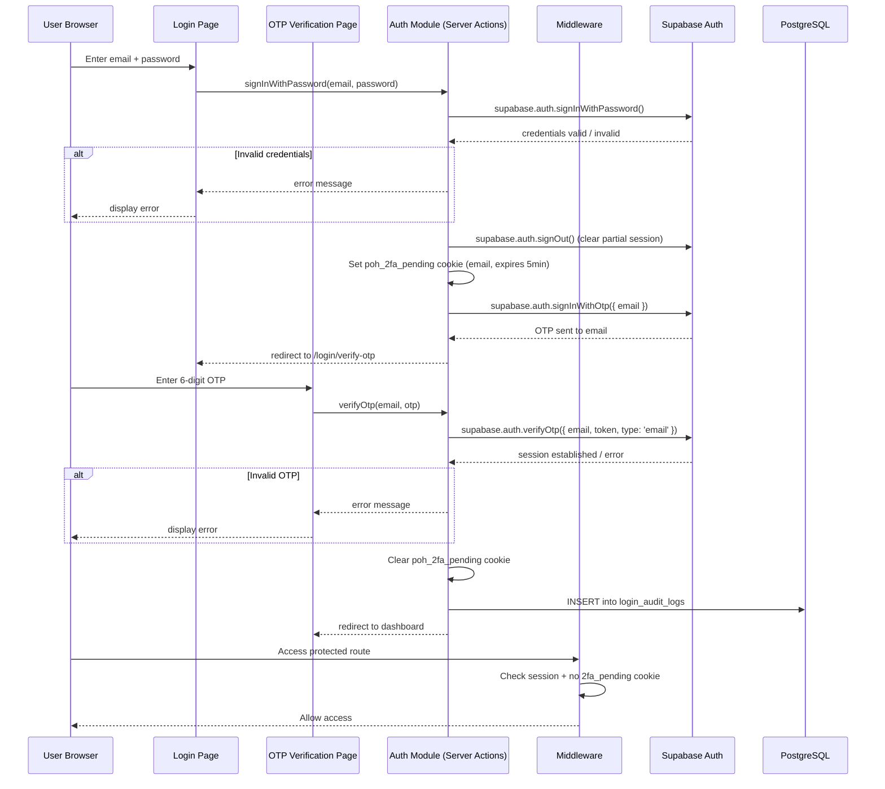
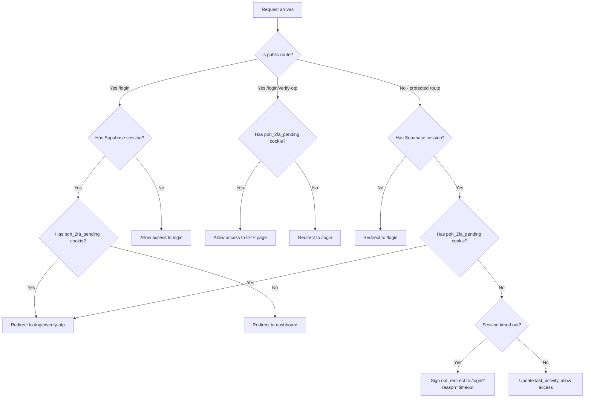

# Design Document: OTP Authentication

## Overview

This design adds mandatory two-factor authentication (2FA) to the Railway POH Management System. The current login flow authenticates users with email + password via Supabase Auth and immediately establishes a full session. The new flow introduces a second step: after successful password verification, Supabase sends a 6-digit OTP to the user's email. The user must verify this OTP on a dedicated page before a full session is established and dashboard access is granted.

The design leverages Supabase Auth's built-in `signInWithOtp` and `verifyOtp` methods rather than implementing custom OTP generation, storage, or delivery. This keeps the security-critical OTP lifecycle within Supabase's managed infrastructure.

Every successful 2FA login is recorded in a `login_audit_logs` table with timestamp, IP address, and geolocation derived from the IP.

### Key Design Decisions

1. **Supabase-managed OTP lifecycle**: OTP generation, delivery, expiry, and rate-limiting are handled by Supabase Auth. We do not store OTPs ourselves.
2. **Cookie-based two-factor state**: After password verification succeeds, a short-lived httpOnly cookie (`poh_2fa_pending`) stores the user's email. This cookie is checked by middleware to enforce the OTP step. It expires after 5 minutes.
3. **No partial session**: The `signIn` function is split into two phases. Phase 1 verifies credentials and triggers OTP delivery without establishing a Supabase session. Phase 2 verifies the OTP and establishes the full session.
4. **IP-based geolocation**: A free IP geolocation API (ip-api.com or similar) is called server-side during audit log creation. Failures are non-blocking — null geolocation is stored.

## Architecture

### Authentication Flow



### Middleware Flow



## Components and Interfaces

### Modified Files

#### 1. `src/lib/supabase/auth.ts` — Auth Module

New and modified server action functions:

```typescript
// Phase 1: Verify password, trigger OTP, set 2FA pending state
export async function signInStep1(email: string, password: string): Promise<{
  success: boolean;
  error?: string;
}>;

// Phase 2: Verify OTP, establish session, log audit entry
export async function verifyLoginOtp(email: string, otp: string): Promise<{
  success: boolean;
  error?: string;
}>;

// Resend OTP to the same email
export async function resendOtp(email: string): Promise<{
  success: boolean;
  error?: string;
}>;

// Clear 2FA pending state (used by "Back to Login")
export async function cancelTwoFactor(): Promise<void>;
```

#### 2. `middleware.ts` — Middleware

Extended to handle the two-factor state:

- Add `/login/verify-otp` to route handling
- Check `poh_2fa_pending` cookie to enforce OTP step
- Redirect users with pending 2FA away from protected routes
- Redirect users without pending 2FA away from OTP page

#### 3. `src/app/(auth)/login/page.tsx` — Login Page (Modified)

- Update `handleSubmit` to call `signInStep1` instead of `signIn`
- On success, redirect to `/login/verify-otp` instead of dashboard

### New Files

#### 4. `src/app/(auth)/login/verify-otp/page.tsx` — OTP Verification Page

Client component with:
- 6-digit numeric input (rejects non-numeric characters)
- Submit button with loading state
- Resend OTP button with cooldown timer
- Masked email display (e.g., `r***@example.com`)
- "Back to Login" link
- Error display for invalid/expired OTP
- ARIA labels and accessible form structure

#### 5. `src/lib/supabase/audit.ts` — Audit Logging Module

```typescript
// Create a login audit log entry
export async function createLoginAuditLog(
  userId: string,
  ipAddress: string
): Promise<void>;

// Lookup geolocation from IP address (non-blocking)
export async function getGeolocation(ip: string): Promise<{
  latitude: number | null;
  longitude: number | null;
} | null>;
```

#### 6. `supabase/migrations/004_login_audit_logs.sql` — Migration

Creates the `login_audit_logs` table and insert-only RLS policy.

### Utility Functions

#### Email Masking

```typescript
// Masks email: "rajesh@example.com" → "r***@example.com"
export function maskEmail(email: string): string;
```

#### OTP Input Validation

```typescript
// Returns true if the string is exactly 6 numeric digits
export function isValidOtp(value: string): boolean;

// Filters non-numeric characters from input
export function sanitizeOtpInput(value: string): string;
```

## Data Models

### New Table: `login_audit_logs`

```sql
CREATE TABLE login_audit_logs (
  id UUID PRIMARY KEY DEFAULT gen_random_uuid(),
  user_id UUID NOT NULL REFERENCES auth.users(id) ON DELETE CASCADE,
  login_timestamp TIMESTAMPTZ NOT NULL DEFAULT NOW(),
  ip_address INET NOT NULL,
  latitude DOUBLE PRECISION,
  longitude DOUBLE PRECISION,
  created_at TIMESTAMPTZ NOT NULL DEFAULT NOW()
);

-- Insert-only: no UPDATE or DELETE allowed
CREATE INDEX idx_login_audit_user ON login_audit_logs(user_id);
CREATE INDEX idx_login_audit_timestamp ON login_audit_logs(login_timestamp DESC);

-- RLS: Only service role can insert, no updates/deletes
ALTER TABLE login_audit_logs ENABLE ROW LEVEL SECURITY;

CREATE POLICY "Service role insert only" ON login_audit_logs
  FOR INSERT
  WITH CHECK (true);

-- No UPDATE or DELETE policies = immutable records
```

### Cookie: `poh_2fa_pending`

| Attribute | Value |
|-----------|-------|
| Name | `poh_2fa_pending` |
| Value | User's email address (encrypted or base64-encoded) |
| httpOnly | `true` |
| secure | `true` in production |
| sameSite | `lax` |
| path | `/` |
| maxAge | 300 (5 minutes) |

This cookie is set after successful password verification and cleared after successful OTP verification or when the user navigates back to login.


## Correctness Properties

*A property is a characteristic or behavior that should hold true across all valid executions of a system — essentially, a formal statement about what the system should do. Properties serve as the bridge between human-readable specifications and machine-verifiable correctness guarantees.*

### Property 1: No session after password-only verification

*For any* valid email and password combination, after calling `signInStep1` successfully, the system shall not have an active Supabase session (i.e., `getSession()` returns null or the session is signed out), and the `poh_2fa_pending` cookie shall be set.

**Validates: Requirements 1.4**

### Property 2: Generic error messages hide credential specifics

*For any* Supabase authentication error message string, the user-friendly error returned by `getUserFriendlyError` shall not contain the substrings "email was incorrect", "password was incorrect", "wrong email", or "wrong password" — ensuring the message does not reveal which credential failed.

**Validates: Requirements 1.5**

### Property 3: Email masking preserves first character and domain

*For any* valid email address of the form `local@domain`, the `maskEmail` function shall return a string where: (a) the first character of the local part is preserved, (b) the remaining local-part characters are replaced with `***`, (c) the `@` symbol and full domain are preserved, and (d) the output is a valid masked email format matching `^.\\*\\*\\*@.+$`.

**Validates: Requirements 2.4**

### Property 4: OTP input sanitization strips non-numeric characters

*For any* input string, the `sanitizeOtpInput` function shall return a string containing only the numeric digits (`0-9`) from the original input, in their original order, with all non-numeric characters removed.

**Validates: Requirements 3.2**

### Property 5: Incomplete OTP is rejected

*For any* string that is empty or has fewer than 6 numeric digits, the `isValidOtp` function shall return `false`. Conversely, *for any* string that is exactly 6 numeric digits, `isValidOtp` shall return `true`.

**Validates: Requirements 3.8**

### Property 6: Middleware routes correctly based on auth state and route type

*For any* combination of authentication state (no session, session with `poh_2fa_pending` cookie, session without `poh_2fa_pending` cookie) and route type (login page, OTP verification page, protected route), the middleware shall:
- Allow unauthenticated users to access `/login` only
- Redirect users with `poh_2fa_pending` cookie to `/login/verify-otp` when accessing protected routes
- Redirect users without `poh_2fa_pending` cookie away from `/login/verify-otp` to `/login`
- Allow fully authenticated users (session, no `poh_2fa_pending`) to access protected routes

**Validates: Requirements 5.1, 5.2, 5.3**

### Property 7: Audit log records contain all required fields

*For any* user ID and IP address, a login audit log record created by `createLoginAuditLog` shall contain: a non-null `user_id` matching the input, a `login_timestamp` in UTC, a non-null `ip_address` matching the input, and `latitude`/`longitude` fields (which may be null if geolocation lookup failed).

**Validates: Requirements 6.2**

## Error Handling

### Password Verification Errors

| Error Source | User-Facing Message | Behavior |
|---|---|---|
| Invalid credentials | "Invalid email or password. Please check your credentials and try again." | Stay on login page, clear password field |
| Rate limit exceeded | "Too many login attempts. Please wait a moment and try again." | Stay on login page, disable submit briefly |
| Network error | "Network error. Please check your connection and try again." | Stay on login page |
| Unknown error | "An error occurred during sign in. Please try again." | Stay on login page |

### OTP Delivery Errors

| Error Source | User-Facing Message | Behavior |
|---|---|---|
| OTP send failure | "Failed to send verification code. Please try again." | Show on OTP page with resend option |
| Rate limit on resend | "Please wait {seconds} seconds before requesting a new code." | Disable resend button, show countdown |

### OTP Verification Errors

| Error Source | User-Facing Message | Behavior |
|---|---|---|
| Invalid OTP | "Invalid verification code. Please check and try again." | Stay on OTP page, clear input |
| Expired OTP | "Verification code has expired. Please request a new one." | Stay on OTP page, show resend option |
| 2FA state expired | Redirect to `/login` | Cookie expired, restart flow |
| Network error | "Network error. Please check your connection and try again." | Stay on OTP page |

### Audit Logging Errors

| Error Source | Behavior |
|---|---|
| Geolocation API failure | Store record with `null` latitude/longitude, do not block login |
| Database insert failure | Log error server-side, do not block login (non-critical path) |

### General Principles

- Authentication errors never reveal whether the email or password was specifically wrong
- OTP delivery and verification errors are distinct to help users take the right corrective action
- Audit logging failures are non-blocking — they must never prevent a successful login
- All error messages are user-friendly and avoid exposing internal system details

## Testing Strategy

### Testing Framework

- **Unit & Integration Tests**: Vitest with `@testing-library/react` and `jsdom`
- **Property-Based Tests**: `fast-check` (already in devDependencies)
- **Minimum iterations**: 100 per property-based test

### Unit Tests

Unit tests cover specific examples, edge cases, and integration points:

1. **Login page rendering**: Verify email/password fields, submit button, and timeout message are present
2. **OTP page rendering**: Verify 6-digit input, submit button, resend button, masked email, back link, and ARIA attributes
3. **signInStep1 success flow**: Mock Supabase, verify OTP is triggered and 2FA cookie is set
4. **signInStep1 failure flows**: Invalid credentials, rate limit, network error — verify correct error messages
5. **verifyLoginOtp success flow**: Mock Supabase, verify session is established, 2FA cookie is cleared, audit log is created
6. **verifyLoginOtp failure flows**: Invalid OTP, expired OTP — verify correct error messages
7. **resendOtp**: Verify Supabase signInWithOtp is called, rate limit handling
8. **cancelTwoFactor**: Verify 2FA cookie is cleared
9. **Middleware routing**: Test each auth state × route type combination
10. **Audit log creation**: Verify record structure, geolocation failure handling
11. **Session timeout after 2FA**: Verify redirect to login with timeout reason

### Property-Based Tests

Each property test references its design document property and runs a minimum of 100 iterations.

| Test | Property | Description |
|---|---|---|
| `signInStep1 does not establish session` | Feature: otp-authentication, Property 1: No session after password-only verification | Generate random valid credentials, verify no session after step 1 |
| `getUserFriendlyError hides specifics` | Feature: otp-authentication, Property 2: Generic error messages hide credential specifics | Generate random error strings, verify output never reveals which credential failed |
| `maskEmail preserves structure` | Feature: otp-authentication, Property 3: Email masking preserves first character and domain | Generate random valid emails, verify masking rules |
| `sanitizeOtpInput strips non-numeric` | Feature: otp-authentication, Property 4: OTP input sanitization strips non-numeric characters | Generate random strings, verify only digits remain in order |
| `isValidOtp rejects incomplete input` | Feature: otp-authentication, Property 5: Incomplete OTP is rejected | Generate random strings of varying lengths, verify validation |
| `middleware routes by auth state` | Feature: otp-authentication, Property 6: Middleware routes correctly based on auth state and route type | Generate random auth state × route combinations, verify routing |
| `audit log contains required fields` | Feature: otp-authentication, Property 7: Audit log records contain all required fields | Generate random user IDs and IPs, verify record structure |

### Test File Organization

```
src/__tests__/
  otp-auth/
    login-step1.test.tsx        # Unit tests for password verification step
    verify-otp.test.tsx         # Unit tests for OTP verification step
    otp-page.test.tsx           # Unit tests for OTP verification page rendering
    middleware-2fa.test.ts      # Unit tests for middleware routing with 2FA
    audit-log.test.ts           # Unit tests for audit logging
    otp-properties.test.ts      # Property-based tests for all 7 properties
```
