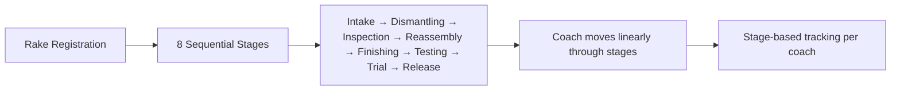
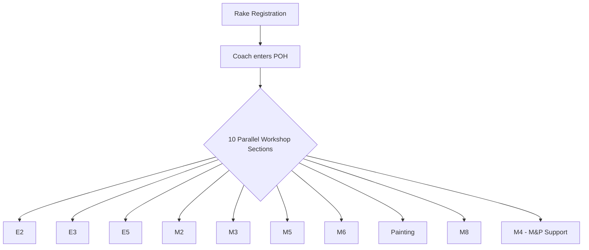
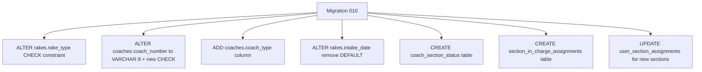
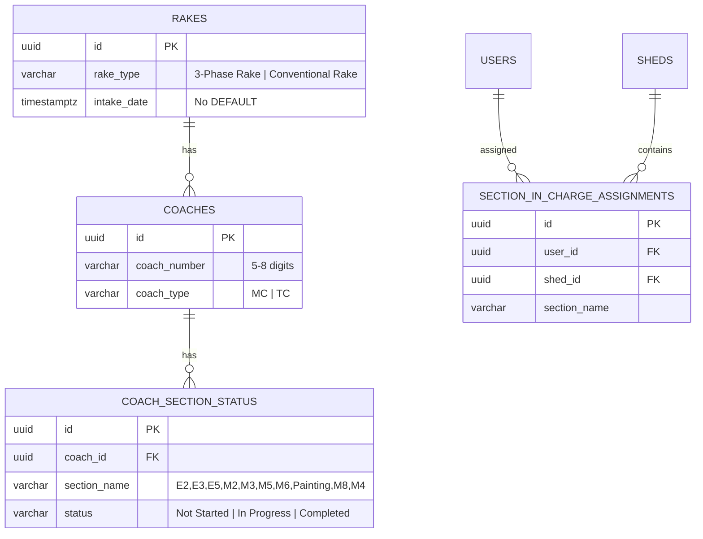

# Design Document — POH Architecture Changes

## Overview

Yeh design document Railway POH Management System mein 7 major changes cover karta hai:

1. **Rake Type Options** — "EMU"/"MEMU" se "3-Phase Rake"/"Conventional Rake" mein change
2. **Coach Number Validation** — 6-digit fixed se 5-8 digit flexible validation
3. **Intake Auto-Advance** — Existing coaches ke liye automatic navigation after intake
4. **Intake Date Calendar** — Manual date picker with no-future-date constraint
5. **Coach Type Field** — MC/TC classification per coach
6. **POH Sections Architecture** — 8 sequential stages se 10 fixed workshop sections
7. **Database Migration** — Schema changes for all above features

### Tech Stack
- **Frontend**: Next.js 14 (App Router), React, Tailwind CSS
- **Backend**: Supabase (PostgreSQL), Server Actions
- **Validation**: Zod (client + server)
- **Auth**: Supabase Auth with RLS policies

### Key Design Decisions
- POH Sections replace the sequential stage model with parallel workshop sections
- Each section operates independently — no sequential dependency between sections
- Section In-Charge (SSE) sees only their assigned section's data
- M4 is M&P/Machinery support section (NOT M9)
- Painting is a separate section from M2
- Migration is additive — backward compatible with rollback support

## Architecture

### Current Architecture (Before)



- Rake types: EMU / MEMU
- Coach numbers: exactly 6 digits
- Stages: 8 sequential (Intake → Release)
- No coach type (MC/TC) distinction
- Intake date: auto-set to NOW()
- Sections: Generic main sections + sub-sections (E1-E10, M1-M10)

### New Architecture (After)



- Rake types: "3-Phase Rake" / "Conventional Rake"
- Coach numbers: 5-8 digits
- Sections: 10 fixed parallel workshop sections
- Coach type: MC or TC per coach
- Intake date: manual calendar picker (no future dates)
- Each section has independent status tracking per coach
- Section In-Charge sees only their section's data

### Migration Strategy



Single migration file `010_poh_architecture_changes.sql` handles all schema changes. Existing data remains valid — EMU/MEMU values will need a data migration step to map to new rake types.

## Components and Interfaces

### 1. Zod Validation Schemas (`src/lib/validations/rake.ts`)

**Changes:**
- `rakeDetailsSchema.rakeType`: Change enum from `['EMU', 'MEMU']` to `['3-Phase Rake', 'Conventional Rake']`
- `coachNumberSchema`: Change regex from `^\d{6}$` to `^\d{5,8}$`
- Add `coachTypeSchema`: Zod enum `['MC', 'TC']`
- Add `intakeDateSchema`: Zod date with max(today) validation
- Update `fullRegistrationSchema` to include coach types array

```typescript
// New/modified schemas
export const rakeTypeSchema = z.enum(['3-Phase Rake', 'Conventional Rake']);
export const coachTypeSchema = z.enum(['MC', 'TC']);
export const coachNumberSchema = z.string().regex(/^\d{5,8}$/, 'Must be 5 to 8 digits');
export const intakeDateSchema = z.string().refine(
  (val) => new Date(val) <= new Date(),
  'Future dates are not allowed'
);
```

### 2. TypeScript Types (`src/types/index.ts`)

**Changes:**
- `RakeType`: Change from `'EMU' | 'MEMU'` to `'3-Phase Rake' | 'Conventional Rake'`
- Add `CoachType`: `'MC' | 'TC'`
- Add `POHSection`: `'E2' | 'E3' | 'E5' | 'M2' | 'M3' | 'M5' | 'M6' | 'Painting' | 'M8' | 'M4'`
- Add `SectionWorkStatus`: `'Not Started' | 'In Progress' | 'Completed'`
- Update `CoachSummary` and `CoachDetail` interfaces to include `coachType`

### 3. Constants (`src/lib/constants.ts`)

**Changes:**
- Add `POH_SECTIONS` constant array: `['E2', 'E3', 'E5', 'M2', 'M3', 'M5', 'M6', 'Painting', 'M8', 'M4']`
- Add `RAKE_TYPES` constant: `['3-Phase Rake', 'Conventional Rake']`
- Add `COACH_TYPES` constant: `['MC', 'TC']`
- Keep existing `POH_STAGE_ORDER` for backward compatibility during transition

```typescript
export const POH_SECTIONS = [
  'E2', 'E3', 'E5', 'M2', 'M3', 'M5', 'M6', 'Painting', 'M8', 'M4'
] as const;

export const RAKE_TYPES = ['3-Phase Rake', 'Conventional Rake'] as const;
export const COACH_TYPES = ['MC', 'TC'] as const;
```

### 4. Registration Form (`src/components/rakes/registration-form.tsx`)

**Changes:**
- Step 1: Replace EMU/MEMU buttons with "3-Phase Rake"/"Conventional Rake"
- Step 2: Add Coach Type (MC/TC) selector alongside each coach number input
- Step 2: Update coach number input to accept 5-8 digits (maxLength=8, placeholder update)
- Step 3: Display coach type alongside coach number in review
- Update auto-save draft interface to include coach types

### 5. Intake Form Component

**Changes:**
- Add `intake_date` calendar Date Picker field, pre-filled with today's date
- Add validation: no future dates allowed
- Add auto-advance logic: after intake completion for existing shed coaches, navigate to next step within 1 second
- Show brief loading indicator during auto-advance

### 6. Server Actions (`src/lib/actions/rake.ts`)

**Changes:**
- Update `createRake` to accept and store `coachTypes` array alongside `coachNumbers`
- Update `createRake` to accept `intakeDate` parameter instead of using `NOW()`
- Insert `coach_type` when creating coach records
- After coach creation, create initial `coach_section_status` rows for all 10 sections

### 7. Permissions & Section Filtering (`src/lib/auth/permissions.ts`)

**Changes:**
- Add `canAccessSection(userId, sectionName)` function
- Add `getUserSections(userId, shedId)` to get assigned POH sections
- Section In-Charge (SSE) data filtering: dashboard, coach lists, work items filtered by assigned section

### 8. Dashboard & Coach Views

**Changes:**
- Dashboard: Show section-wise progress instead of stage-wise for Section In-Charge users
- Admin dashboard: Aggregated view across all 10 sections
- Coach detail: Show section-wise work status grid (10 sections × status)
- Coach listing: Display coach_type (MC/TC) badge alongside coach number

## Data Models

### Modified Tables

#### `rakes` table
| Column | Before | After | Notes |
|--------|--------|-------|-------|
| `rake_type` | `VARCHAR(10) CHECK IN ('EMU','MEMU')` | `VARCHAR(20) CHECK IN ('3-Phase Rake','Conventional Rake')` | Wider VARCHAR for longer names |
| `intake_date` | `TIMESTAMPTZ NOT NULL DEFAULT NOW()` | `TIMESTAMPTZ NOT NULL` | Remove DEFAULT — user must provide |

#### `coaches` table
| Column | Before | After | Notes |
|--------|--------|-------|-------|
| `coach_number` | `VARCHAR(6) CHECK ~ '^[0-9]{6}$'` | `VARCHAR(8) CHECK ~ '^[0-9]{5,8}$'` | 5-8 digits |
| `coach_type` | — (new) | `VARCHAR(2) NOT NULL CHECK IN ('MC','TC')` | New required column |

### New Tables

#### `coach_section_status`
Tracks per-coach, per-section work status. One row per coach per section.

| Column | Type | Constraints |
|--------|------|-------------|
| `id` | `UUID` | PK, DEFAULT gen_random_uuid() |
| `coach_id` | `UUID` | FK → coaches(id) ON DELETE CASCADE |
| `section_name` | `VARCHAR(20)` | CHECK IN (10 POH sections) |
| `status` | `VARCHAR(20)` | DEFAULT 'Not Started', CHECK IN ('Not Started','In Progress','Completed') |
| `started_at` | `TIMESTAMPTZ` | NULL |
| `completed_at` | `TIMESTAMPTZ` | NULL |
| `completed_by` | `UUID` | FK → users(id), NULL |
| `notes` | `TEXT` | NULL |
| `created_at` | `TIMESTAMPTZ` | DEFAULT NOW() |
| `updated_at` | `TIMESTAMPTZ` | DEFAULT NOW() |
| **UNIQUE** | `(coach_id, section_name)` | |

#### `section_in_charge_assignments`
Links SSE users to specific POH sections within a shed. Replaces generic section assignments for POH workflow.

| Column | Type | Constraints |
|--------|------|-------------|
| `id` | `UUID` | PK, DEFAULT gen_random_uuid() |
| `user_id` | `UUID` | FK → users(id) ON DELETE CASCADE |
| `shed_id` | `UUID` | FK → sheds(id) ON DELETE CASCADE |
| `section_name` | `VARCHAR(20)` | CHECK IN (10 POH sections) |
| `created_at` | `TIMESTAMPTZ` | DEFAULT NOW() |
| **UNIQUE** | `(user_id, shed_id, section_name)` | |

### Entity Relationship (New)



## Correctness Properties

*A property is a characteristic or behavior that should hold true across all valid executions of a system — essentially, a formal statement about what the system should do. Properties serve as the bridge between human-readable specifications and machine-verifiable correctness guarantees.*

### Property 1: Rake Type Validation

*For any* string value, the Zod rake type schema should accept it if and only if it equals "3-Phase Rake" or "Conventional Rake". All other strings must be rejected.

**Validates: Requirements 1.4, 1.5, 7.1**

### Property 2: Coach Number Validation

*For any* string value, the Zod coach number schema should accept it if and only if it matches the regex `^\d{5,8}$` (contains only digits and has length between 5 and 8 inclusive). Strings with non-numeric characters, fewer than 5 digits, or more than 8 digits must be rejected.

**Validates: Requirements 2.1, 2.2, 2.3, 2.4, 2.6**

### Property 3: Coach Type Validation

*For any* string value, the Zod coach type schema should accept it if and only if it equals "MC" or "TC". All other strings must be rejected.

**Validates: Requirements 5.3, 5.4, 7.3**

### Property 4: Intake Date Rejects Future Dates

*For any* date value, the intake date validation should accept it if and only if the date is on or before the current date. All future dates must be rejected.

**Validates: Requirements 4.5, 4.6**

### Property 5: Rake Type Round-Trip

*For any* valid rake type ("3-Phase Rake" or "Conventional Rake"), creating a rake with that type and reading it back from the database should return the same rake type value.

**Validates: Requirements 1.3**

### Property 6: Coach Section Status Invariant

*For any* coach that has been created in the system, there should be exactly 10 `coach_section_status` records — one for each of the 10 defined POH sections (E2, E3, E5, M2, M3, M5, M6, Painting, M8, M4). No duplicates and no missing sections.

**Validates: Requirements 6.9, 7.5**

### Property 7: Section Status Independence

*For any* coach and any POH section, updating the status of that section to "In Progress" or "Completed" should not change the status of any other section for the same coach.

**Validates: Requirements 6.9**

### Property 8: Section In-Charge Data Filtering

*For any* Section In-Charge user assigned to a specific POH section, all coach section status records returned by dashboard/listing queries should belong only to the user's assigned section(s). No data from unassigned sections should be visible.

**Validates: Requirements 6.4, 6.6, 6.8**

### Property 9: Section Assignment Round-Trip

*For any* valid user, shed, and POH section combination, creating a section_in_charge_assignment and querying it back should return the same user-shed-section mapping.

**Validates: Requirements 6.7, 7.6**

### Property 10: POH Sections Constant Integrity

*For any* access to the POH_SECTIONS constant, it should always return exactly 10 values matching the set {E2, E3, E5, M2, M3, M5, M6, Painting, M8, M4} with no duplicates.

**Validates: Requirements 6.1, 6.3**

## Error Handling

### Validation Errors
- **Client-side (Zod)**: All form inputs validated before submission. Errors displayed inline next to the field.
- **Server-side (Server Actions)**: Re-validate all inputs. Return `{ success: false, error: string }` on failure.
- **Database (CHECK constraints)**: Last line of defense. Supabase returns PostgreSQL error codes — server actions catch and return user-friendly messages.

### Specific Error Scenarios

| Scenario | Error Message (Hindi-friendly) | Handling |
|----------|-------------------------------|----------|
| Invalid rake type | "Rake type select karein" | Zod enum validation |
| Coach number < 5 or > 8 digits | "Coach number 5 se 8 digits ka hona chahiye" | Zod regex validation |
| Non-numeric coach number | "Sirf numbers allowed hain" | Zod regex validation |
| Missing coach type | "Coach type (MC/TC) select karein" | Zod enum validation |
| Future intake date | "Future date allowed nahi hai" | Zod refine + DB constraint |
| Missing intake date | "Intake date required hai" | Zod required field |
| Duplicate coach number in rake | "Sab coach numbers unique hone chahiye" | Array uniqueness check |
| DB constraint violation | "Data save nahi ho paya, please retry" | Server action catch |
| Section assignment conflict | "User already assigned to this section" | UNIQUE constraint |

### Auto-Advance Error Handling
- If navigation fails during auto-advance, show a toast notification and remain on current view
- Auto-advance timeout: 1 second max, then fallback to manual navigation

## Testing Strategy

### Property-Based Testing

**Library**: `fast-check` (TypeScript property-based testing library)
**Configuration**: Minimum 100 iterations per property test
**Tag format**: `Feature: poh-architecture-changes, Property {N}: {title}`

Each correctness property (1-10) will be implemented as a single `fast-check` property test:

1. **Rake Type Validation** — Generate arbitrary strings, verify Zod schema accepts iff valid
2. **Coach Number Validation** — Generate arbitrary strings, verify regex acceptance
3. **Coach Type Validation** — Generate arbitrary strings, verify Zod schema accepts iff valid
4. **Intake Date Rejects Future** — Generate arbitrary dates, verify acceptance based on today
5. **Rake Type Round-Trip** — Generate valid rake types, create + read back
6. **Coach Section Status Invariant** — Create coaches, verify exactly 10 section records
7. **Section Status Independence** — Update one section, verify others unchanged
8. **Section Data Filtering** — Assign sections, query, verify no cross-section leakage
9. **Section Assignment Round-Trip** — Create assignments, read back, verify match
10. **POH Sections Constant** — Verify constant array integrity

### Unit Tests (Examples & Edge Cases)

- Registration form renders "3-Phase Rake" and "Conventional Rake" options (Req 1.1)
- Registration form renders MC/TC selector per coach (Req 5.1)
- Empty rake type submission shows validation error (Req 1.2)
- Empty coach type submission shows validation error (Req 5.2)
- Intake form renders date picker with today's date (Req 4.1, 4.2)
- Empty intake date submission shows validation error (Req 4.3)
- Auto-advance triggers for existing shed coaches (Req 3.1)
- Auto-advance does NOT trigger for newly registered coaches (Req 3.2)
- Loading indicator shown during auto-advance (Req 3.3)
- Coach type displayed in coach listing views (Req 5.6)
- POH_SECTIONS constant has exactly 10 values (Req 6.1)
- Admin can assign Section In-Charge (Req 6.5)
- Admin sees aggregated view across all sections (Req 6.10)
- INSERT without intake_date fails after migration (Req 7.4)

### Integration Tests

- Full rake registration flow with new fields (rake type, coach type, intake date)
- Section In-Charge login → filtered dashboard view
- Admin login → aggregated dashboard view
- Migration rollback verification
