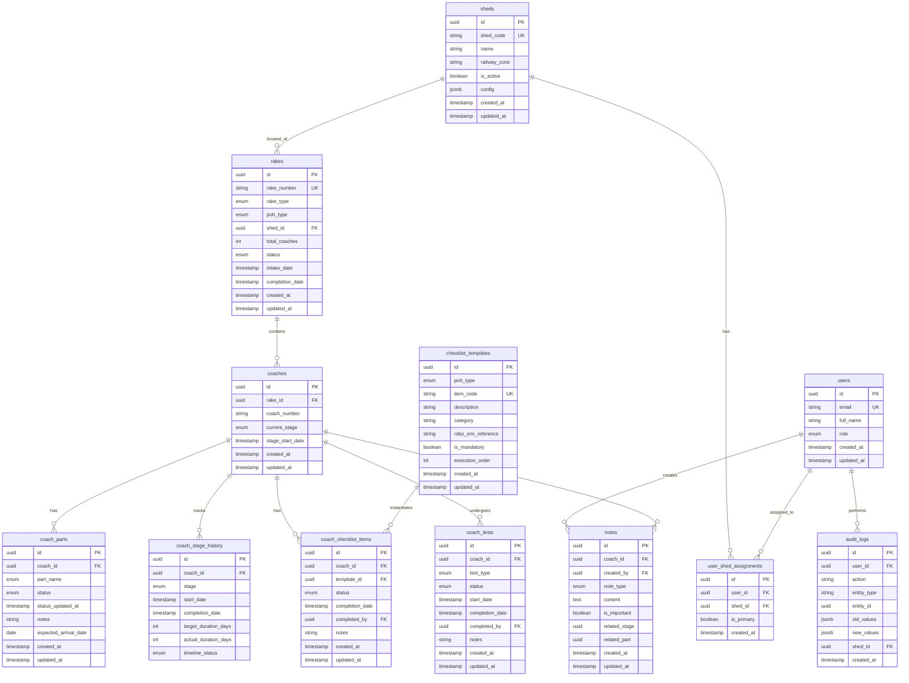

# Design Document: Railway POH Management System

## Overview

The Railway POH Management System is a Next.js 14+ web application built with TypeScript, React 18+, and Tailwind CSS, backed by Supabase (PostgreSQL) for data persistence and real-time synchronization. The system provides comprehensive tracking and management of Periodic Overhaul (POH) operations for EMU/MEMU railway rakes across multiple maintenance sheds throughout the Indian Railways network.

### Design Philosophy

The system follows a premium, clean UI approach with minimal design focused on clarity and usability. Key principles include:

- **Not Overcrowded**: Show only essential information, use progressive disclosure for details
- **Data Visualization**: Clean charts and graphs for analytics with clear visual hierarchy
- **Professional Aesthetics**: Railway industry-appropriate design with consistent color coding
- **Performance First**: Server Components for data fetching, optimistic UI updates, efficient queries
- **Real-time Collaboration**: Supabase real-time subscriptions for live status updates across users

### System Scope

The system manages:
- Multi-shed operations with shed-specific user assignments and data filtering
- Rake registration and tracking (6-20 coaches per rake)
- Independent coach-level progression through 8 sequential POH stages
- 9 major component parts per coach with lifecycle tracking
- POH type-specific checklists with RDSO SMI compliance
- Timeline monitoring with delay detection and notifications
- Testing phase management (Electrical, Mechanical, Pneumatic)
- Role-based access control with shed-based data isolation
- Historical records and performance analytics

### Technology Stack

- **Frontend**: Next.js 14+ (App Router), React 18+, TypeScript (strict mode)
- **Styling**: Tailwind CSS with custom design system
- **Database**: Supabase (PostgreSQL) with Row Level Security
- **Authentication**: Supabase Auth with role-based access control
- **Real-time**: Supabase real-time subscriptions
- **State Management**: React Server Components + Client Components with optimistic updates
- **Data Fetching**: Server Actions, Supabase client
- **Validation**: Zod schemas for type-safe validation
- **Charts**: Recharts or Chart.js for data visualization
- **Date Handling**: date-fns for IST timezone management


## Architecture

### High-Level Architecture

```
┌─────────────────────────────────────────────────────────────┐
│                     Client Browser                          │
│  ┌───────────────────────────────────────────────────────┐  │
│  │         Next.js App Router (React 18+)                │  │
│  │  ┌─────────────────┐    ┌─────────────────────────┐  │  │
│  │  │ Server          │    │ Client Components       │  │  │
│  │  │ Components      │    │ - Interactive UI        │  │  │
│  │  │ - Data Fetching │    │ - Forms                 │  │  │
│  │  │ - Initial Render│    │ - Real-time Updates     │  │  │
│  │  └─────────────────┘    └─────────────────────────┘  │  │
│  └───────────────────────────────────────────────────────┘  │
└─────────────────────────────────────────────────────────────┘
                            │
                            │ HTTPS
                            ▼
┌─────────────────────────────────────────────────────────────┐
│                    Next.js Server                           │
│  ┌───────────────────────────────────────────────────────┐  │
│  │              Server Actions / API Routes              │  │
│  │  - Authentication                                     │  │
│  │  - Data Mutations                                     │  │
│  │  - Business Logic                                     │  │
│  │  - Validation                                         │  │
│  └───────────────────────────────────────────────────────┘  │
└─────────────────────────────────────────────────────────────┘
                            │
                            │ PostgREST API
                            ▼
┌─────────────────────────────────────────────────────────────┐
│                    Supabase Platform                        │
│  ┌──────────────┐  ┌──────────────┐  ┌──────────────────┐  │
│  │ PostgreSQL   │  │ Auth Service │  │ Real-time Engine │  │
│  │ - Data Store │  │ - JWT Tokens │  │ - WebSocket      │  │
│  │ - RLS        │  │ - Sessions   │  │ - Subscriptions  │  │
│  │ - Triggers   │  │ - Roles      │  │ - Broadcasts     │  │
│  └──────────────┘  └──────────────┘  └──────────────────┘  │
└─────────────────────────────────────────────────────────────┘
```

### Application Architecture Layers

#### 1. Presentation Layer (Client)
- **Server Components**: Initial page renders, data fetching, SEO optimization
- **Client Components**: Interactive elements, forms, real-time updates
- **Layout Components**: Shared layouts with shed selector, navigation
- **UI Components**: Reusable design system components (buttons, cards, badges)

#### 2. Application Layer (Next.js Server)
- **Server Actions**: Type-safe mutations with Zod validation
- **API Routes**: Complex operations, bulk updates, exports
- **Middleware**: Authentication checks, shed access validation
- **Utilities**: Date formatting (IST), status calculations, timeline logic

#### 3. Data Layer (Supabase)
- **PostgreSQL Database**: Normalized schema with foreign keys and indexes
- **Row Level Security**: Shed-based data isolation per user role
- **Database Functions**: Complex aggregations, timeline calculations
- **Triggers**: Automatic timestamp updates, audit trail logging
- **Real-time**: Change data capture for live updates

### Data Flow Patterns

#### Read Operations (Server Components)
```
User Request → Server Component → Supabase Query (with RLS) → Render HTML → Client
```

#### Write Operations (Client Components)
```
User Action → Client Component → Server Action → Validation → Supabase Mutation → 
Optimistic Update → Real-time Broadcast → All Connected Clients Update
```

#### Real-time Updates
```
Database Change → Supabase Real-time → WebSocket → Client Subscription → 
Component Re-render
```

### Security Architecture

#### Authentication Flow
1. User logs in via Supabase Auth (email/password)
2. Supabase issues JWT token with user metadata (role, shed_assignments)
3. Token stored in httpOnly cookie
4. Middleware validates token on each request
5. RLS policies enforce shed-based access at database level

#### Authorization Layers
- **Middleware**: Route-level access control
- **Server Actions**: Function-level permission checks
- **RLS Policies**: Row-level data isolation by shed and role
- **Client UI**: Conditional rendering based on user role

#### Row Level Security Strategy
```sql
-- Example RLS policy for rake table
CREATE POLICY "Users can view rakes from their assigned sheds"
ON rakes FOR SELECT
USING (
  auth.uid() IN (
    SELECT user_id FROM user_shed_assignments 
    WHERE shed_id = rakes.shed_id
  )
  OR
  EXISTS (
    SELECT 1 FROM users 
    WHERE id = auth.uid() AND role = 'Admin'
  )
);
```


## Components and Interfaces

### Component Hierarchy

```
app/
├── layout.tsx (Root Layout - Auth Provider)
├── (auth)/
│   ├── login/page.tsx (Login Page)
│   └── layout.tsx (Auth Layout)
├── (dashboard)/
│   ├── layout.tsx (Dashboard Layout - Sidebar, Header with Shed Selector)
│   ├── page.tsx (Dashboard - Multi-Rake View)
│   ├── rakes/
│   │   ├── [rakeId]/
│   │   │   ├── page.tsx (Rake Detail View)
│   │   │   └── coaches/[coachId]/page.tsx (Coach Detail View)
│   │   └── new/page.tsx (Rake Registration Form)
│   ├── completed/page.tsx (Historical Records)
│   ├── reports/page.tsx (Performance Reports)
│   └── settings/
│       ├── sheds/page.tsx (Shed Management - Admin Only)
│       ├── users/page.tsx (User Management - Admin Only)
│       └── config/page.tsx (System Configuration - Admin Only)
```

### Core Components

#### 1. Dashboard Components

**DashboardMetrics** (Server Component)
```typescript
interface DashboardMetricsProps {
  shedId: string | 'all';
}

// Displays: Active rakes count, coaches by stage, avg completion time,
// on-time %, delayed coaches, missing parts count
```

**RakeCard** (Client Component)
```typescript
interface RakeCardProps {
  rake: {
    id: string;
    rakeNumber: string;
    rakeType: 'EMU' | 'MEMU';
    pohType: '1st POH' | '2nd POH' | '3rd POH' | '4th POH';
    shedName: string;
    currentStage: POHStage;
    elapsedDays: number;
    estimatedCompletion: Date;
    coachProgress: { stage: POHStage; count: number }[];
    delayedCoachCount: number;
    missingPartsCount: number;
  };
}

// Visual card with status colors, progress bar, warning indicators
```

**ShedSelector** (Client Component)
```typescript
interface ShedSelectorProps {
  userSheds: Shed[];
  currentShed: string | 'all';
  onShedChange: (shedId: string) => void;
}

// Dropdown in header, defaults to user's primary shed
```

#### 2. Rake Management Components

**RakeRegistrationForm** (Client Component)
```typescript
interface RakeRegistrationFormProps {
  userPrimaryShed: string;
  availableSheds: Shed[];
}

// Multi-step form:
// Step 1: Rake details (number, type, POH type, shed)
// Step 2: Coach numbers (dynamic 6-20 inputs with validation)
// Step 3: Review and submit
```

**RakeDetailView** (Server Component)
```typescript
interface RakeDetailViewProps {
  rakeId: string;
}

// Displays: Rake header, stage progress chart, coach grid,
// aggregate statistics, bulk operation controls
```

**CoachGrid** (Client Component)
```typescript
interface CoachGridProps {
  coaches: Coach[];
  onCoachSelect: (coachIds: string[]) => void;
  selectedCoaches: string[];
}

// Responsive grid (4-5 cols desktop, 2-3 tablet, 1-2 mobile)
// Each cell: coach number, stage badge, status color, warning icons
```

#### 3. Coach Management Components

**CoachDetailView** (Server Component)
```typescript
interface CoachDetailViewProps {
  coachId: string;
}

// Tabbed interface:
// - Overview: Stage timeline, progress summary
// - Parts: 9 parts with status tracking
// - Checklist: POH type-specific items
// - Testing: 3 test types (when in Testing stage)
// - Notes: Chronological notes list
```

**StageTimeline** (Client Component)
```typescript
interface StageTimelineProps {
  stages: {
    name: POHStage;
    status: 'completed' | 'in-progress' | 'not-started';
    startDate?: Date;
    completionDate?: Date;
    targetDuration: number;
    actualDuration?: number;
    timelineStatus?: TimelineStatus;
  }[];
}

// Visual timeline with color-coded stages, duration bars
```

**PartsTracker** (Client Component)
```typescript
interface PartsTrackerProps {
  coachId: string;
  parts: CoachPart[];
  onPartUpdate: (partId: string, status: PartStatus, notes?: string) => void;
}

// Grid of 9 parts, status dropdown, missing part modal
```

**ChecklistManager** (Client Component)
```typescript
interface ChecklistManagerProps {
  coachId: string;
  pohType: POHType;
  items: ChecklistItem[];
  onItemUpdate: (itemId: string, status: ChecklistStatus) => void;
}

// Categorized checklist, mandatory items highlighted,
// RDSO SMI references, completion percentage
```

**TestingPanel** (Client Component)
```typescript
interface TestingPanelProps {
  coachId: string;
  tests: {
    electrical: TestStatus;
    mechanical: TestStatus;
    pneumatic: TestStatus;
  };
  onTestUpdate: (testType: TestType, status: TestStatus) => void;
}

// 3 test cards, status indicators, completion timestamps
```

#### 4. Shared UI Components

**StatusBadge** (Client Component)
```typescript
interface StatusBadgeProps {
  status: TimelineStatus;
  size?: 'sm' | 'md' | 'lg';
}

// Color-coded badge: green (on schedule), yellow (minor delay), red (significant delay)
```

**WarningIndicator** (Client Component)
```typescript
interface WarningIndicatorProps {
  type: 'missing-parts' | 'mandatory-items' | 'delay';
  count?: number;
  tooltip?: string;
}

// Icon with optional count badge, hover tooltip
```

**BulkOperationModal** (Client Component)
```typescript
interface BulkOperationModalProps {
  selectedCoaches: Coach[];
  operation: 'stage-complete' | 'part-update' | 'add-note' | 'checklist-update';
  onConfirm: (data: any) => Promise<void>;
  onCancel: () => void;
}

// Confirmation dialog with affected coaches list, operation details
```

**NotesPanel** (Client Component)
```typescript
interface NotesPanelProps {
  coachId: string;
  notes: Note[];
  onAddNote: (content: string, type: NoteType) => void;
}

// Chronological list, add note form, filter by type
```

#### 5. Analytics Components

**PerformanceChart** (Client Component)
```typescript
interface PerformanceChartProps {
  data: {
    label: string;
    value: number;
    target?: number;
  }[];
  type: 'bar' | 'line' | 'pie';
}

// Recharts wrapper with consistent styling
```

**ReportGenerator** (Client Component)
```typescript
interface ReportGeneratorProps {
  reportType: 'poh-performance' | 'stage-performance' | 'parts-management' | 
               'timeline-performance' | 'checklist-compliance';
  filters: ReportFilters;
  onExport: (format: 'pdf' | 'excel' | 'csv') => void;
}

// Report configuration form, preview, export buttons
```

### API Interfaces

#### Server Actions

```typescript
// Rake Management
export async function createRake(data: RakeRegistrationData): Promise<Result<Rake>>;
export async function updateRakeStatus(rakeId: string, status: RakeStatus): Promise<Result<void>>;

// Coach Management
export async function updateCoachStage(coachId: string, stage: POHStage): Promise<Result<void>>;
export async function bulkUpdateCoaches(coachIds: string[], update: CoachUpdate): Promise<Result<BulkResult>>;

// Parts Management
export async function updatePartStatus(partId: string, status: PartStatus, notes?: string, expectedDate?: Date): Promise<Result<void>>;

// Checklist Management
export async function updateChecklistItem(itemId: string, coachId: string, status: ChecklistStatus): Promise<Result<void>>;

// Testing Management
export async function updateTestStatus(coachId: string, testType: TestType, status: TestStatus): Promise<Result<void>>;

// Notes Management
export async function addNote(coachId: string, content: string, type: NoteType): Promise<Result<Note>>;

// User Management (Admin only)
export async function assignUserToShed(userId: string, shedId: string, isPrimary: boolean): Promise<Result<void>>;

// Shed Management (Admin only)
export async function createShed(data: ShedData): Promise<Result<Shed>>;
export async function updateShedConfig(shedId: string, config: ShedConfig): Promise<Result<void>>;
```

#### API Routes

```typescript
// GET /api/dashboard/metrics?shedId={shedId}
// Returns: Dashboard metrics for specified shed

// GET /api/rakes?shedId={shedId}&status={status}&filters={...}
// Returns: Paginated list of rakes with filters

// GET /api/rakes/[rakeId]
// Returns: Complete rake details with all coaches

// GET /api/coaches/[coachId]
// Returns: Complete coach details with parts, checklist, notes

// POST /api/reports/generate
// Body: { reportType, filters, format }
// Returns: Generated report file

// POST /api/bulk-operations
// Body: { coachIds, operation, data }
// Returns: Bulk operation results

// GET /api/notifications
// Returns: User notifications

// POST /api/export
// Body: { rakeId, format, fields }
// Returns: Exported file
```

### Type Definitions

```typescript
// Core Types
type POHStage = 'Intake' | 'Dismantling' | 'Inspection' | 'Reassembly' | 
                'Finishing' | 'Testing' | 'Trial' | 'Release';
type POHType = '1st POH' | '2nd POH' | '3rd POH' | '4th POH';
type RakeType = 'EMU' | 'MEMU';
type RakeStatus = 'Active' | 'Completed';
type TimelineStatus = 'On Schedule' | 'Minor Delay' | 'Significant Delay' | 'Ahead of Schedule';
type PartStatus = 'Not Started' | 'Dismantled' | 'Under Inspection' | 
                  'Overhauled/Repaired' | 'Reassembled' | 'Tested' | 'Missing/Pending';
type ChecklistStatus = 'Not Started' | 'In Progress' | 'Completed';
type TestStatus = 'Not Started' | 'In Progress' | 'Completed';
type TestType = 'Electrical' | 'Mechanical' | 'Pneumatic';
type NoteType = 'General' | 'Stage-Specific' | 'Part-Specific';
type UserRole = 'Admin' | 'Section_Engineer' | 'Technician' | 'Viewer';

// Result Type for Error Handling
type Result<T> = 
  | { success: true; data: T }
  | { success: false; error: string };
```


## Data Models

### Database Schema (PostgreSQL/Supabase)

#### Entity Relationship Diagram



### Table Definitions

#### sheds
```sql
CREATE TABLE sheds (
  id UUID PRIMARY KEY DEFAULT gen_random_uuid(),
  shed_code VARCHAR(20) UNIQUE NOT NULL,
  name VARCHAR(200) NOT NULL,
  railway_zone VARCHAR(100) NOT NULL,
  is_active BOOLEAN DEFAULT true,
  config JSONB DEFAULT '{
    "target_durations": {
      "Intake": 1,
      "Dismantling": 2,
      "Inspection": 6,
      "Reassembly": 3,
      "Finishing": 2,
      "Testing": 3,
      "Trial": 2,
      "Release": 1
    },
    "delay_thresholds": {
      "minor": 1,
      "significant": 2
    },
    "notification_preferences": {
      "stage_completion": true,
      "significant_delay": true,
      "missing_parts": true,
      "testing_complete": true
    }
  }'::jsonb,
  created_at TIMESTAMPTZ DEFAULT NOW(),
  updated_at TIMESTAMPTZ DEFAULT NOW()
);

CREATE INDEX idx_sheds_active ON sheds(is_active);
CREATE INDEX idx_sheds_code ON sheds(shed_code);
```

#### users
```sql
CREATE TABLE users (
  id UUID PRIMARY KEY REFERENCES auth.users(id) ON DELETE CASCADE,
  email VARCHAR(255) UNIQUE NOT NULL,
  full_name VARCHAR(200) NOT NULL,
  role VARCHAR(50) NOT NULL CHECK (role IN ('Admin', 'Section_Engineer', 'Technician', 'Viewer')),
  created_at TIMESTAMPTZ DEFAULT NOW(),
  updated_at TIMESTAMPTZ DEFAULT NOW()
);

CREATE INDEX idx_users_role ON users(role);
CREATE INDEX idx_users_email ON users(email);
```

#### user_shed_assignments
```sql
CREATE TABLE user_shed_assignments (
  id UUID PRIMARY KEY DEFAULT gen_random_uuid(),
  user_id UUID NOT NULL REFERENCES users(id) ON DELETE CASCADE,
  shed_id UUID NOT NULL REFERENCES sheds(id) ON DELETE CASCADE,
  is_primary BOOLEAN DEFAULT false,
  created_at TIMESTAMPTZ DEFAULT NOW(),
  UNIQUE(user_id, shed_id)
);

CREATE INDEX idx_user_shed_user ON user_shed_assignments(user_id);
CREATE INDEX idx_user_shed_shed ON user_shed_assignments(shed_id);
CREATE INDEX idx_user_shed_primary ON user_shed_assignments(user_id, is_primary);
```

#### rakes
```sql
CREATE TABLE rakes (
  id UUID PRIMARY KEY DEFAULT gen_random_uuid(),
  rake_number VARCHAR(50) NOT NULL,
  rake_type VARCHAR(10) NOT NULL CHECK (rake_type IN ('EMU', 'MEMU')),
  poh_type VARCHAR(10) NOT NULL CHECK (poh_type IN ('1st POH', '2nd POH', '3rd POH', '4th POH')),
  shed_id UUID NOT NULL REFERENCES sheds(id) ON DELETE RESTRICT,
  total_coaches INT NOT NULL CHECK (total_coaches BETWEEN 6 AND 20),
  status VARCHAR(20) NOT NULL DEFAULT 'Active' CHECK (status IN ('Active', 'Completed')),
  intake_date TIMESTAMPTZ NOT NULL DEFAULT NOW(),
  completion_date TIMESTAMPTZ,
  created_at TIMESTAMPTZ DEFAULT NOW(),
  updated_at TIMESTAMPTZ DEFAULT NOW(),
  UNIQUE(rake_number, shed_id, status) WHERE status = 'Active'
);

CREATE INDEX idx_rakes_shed ON rakes(shed_id);
CREATE INDEX idx_rakes_status ON rakes(status);
CREATE INDEX idx_rakes_intake ON rakes(intake_date);
CREATE INDEX idx_rakes_number ON rakes(rake_number);
```

#### coaches
```sql
CREATE TABLE coaches (
  id UUID PRIMARY KEY DEFAULT gen_random_uuid(),
  rake_id UUID NOT NULL REFERENCES rakes(id) ON DELETE CASCADE,
  coach_number VARCHAR(6) NOT NULL CHECK (coach_number ~ '^[0-9]{6}$'),
  current_stage VARCHAR(20) NOT NULL DEFAULT 'Intake' CHECK (
    current_stage IN ('Intake', 'Dismantling', 'Inspection', 'Reassembly', 
                      'Finishing', 'Testing', 'Trial', 'Release')
  ),
  stage_start_date TIMESTAMPTZ NOT NULL DEFAULT NOW(),
  created_at TIMESTAMPTZ DEFAULT NOW(),
  updated_at TIMESTAMPTZ DEFAULT NOW(),
  UNIQUE(rake_id, coach_number)
);

CREATE INDEX idx_coaches_rake ON coaches(rake_id);
CREATE INDEX idx_coaches_stage ON coaches(current_stage);
CREATE INDEX idx_coaches_number ON coaches(coach_number);
```

#### coach_stage_history
```sql
CREATE TABLE coach_stage_history (
  id UUID PRIMARY KEY DEFAULT gen_random_uuid(),
  coach_id UUID NOT NULL REFERENCES coaches(id) ON DELETE CASCADE,
  stage VARCHAR(20) NOT NULL CHECK (
    stage IN ('Intake', 'Dismantling', 'Inspection', 'Reassembly', 
              'Finishing', 'Testing', 'Trial', 'Release')
  ),
  start_date TIMESTAMPTZ NOT NULL,
  completion_date TIMESTAMPTZ,
  target_duration_days INT NOT NULL,
  actual_duration_days INT,
  timeline_status VARCHAR(30) CHECK (
    timeline_status IN ('On Schedule', 'Minor Delay', 'Significant Delay', 'Ahead of Schedule')
  ),
  created_at TIMESTAMPTZ DEFAULT NOW(),
  updated_at TIMESTAMPTZ DEFAULT NOW()
);

CREATE INDEX idx_stage_history_coach ON coach_stage_history(coach_id);
CREATE INDEX idx_stage_history_stage ON coach_stage_history(stage);
CREATE INDEX idx_stage_history_status ON coach_stage_history(timeline_status);
```

#### coach_parts
```sql
CREATE TABLE coach_parts (
  id UUID PRIMARY KEY DEFAULT gen_random_uuid(),
  coach_id UUID NOT NULL REFERENCES coaches(id) ON DELETE CASCADE,
  part_name VARCHAR(50) NOT NULL CHECK (
    part_name IN ('Motor Bogie', 'Trailer Bogie', 'Traction Motor', 'Brake System',
                  'Electrical System', 'Pantograph', 'Couplers', 'Suspension System', 'Body Shell')
  ),
  status VARCHAR(30) NOT NULL DEFAULT 'Not Started' CHECK (
    status IN ('Not Started', 'Dismantled', 'Under Inspection', 'Overhauled/Repaired',
               'Reassembled', 'Tested', 'Missing/Pending')
  ),
  status_updated_at TIMESTAMPTZ DEFAULT NOW(),
  notes TEXT,
  expected_arrival_date DATE,
  created_at TIMESTAMPTZ DEFAULT NOW(),
  updated_at TIMESTAMPTZ DEFAULT NOW(),
  UNIQUE(coach_id, part_name)
);

CREATE INDEX idx_parts_coach ON coach_parts(coach_id);
CREATE INDEX idx_parts_status ON coach_parts(status);
CREATE INDEX idx_parts_missing ON coach_parts(coach_id) WHERE status = 'Missing/Pending';
```

#### checklist_templates
```sql
CREATE TABLE checklist_templates (
  id UUID PRIMARY KEY DEFAULT gen_random_uuid(),
  poh_type VARCHAR(10) NOT NULL CHECK (poh_type IN ('1st POH', '2nd POH', '3rd POH', '4th POH')),
  item_code VARCHAR(50) UNIQUE NOT NULL,
  description TEXT NOT NULL,
  category VARCHAR(100) NOT NULL,
  rdso_smi_reference VARCHAR(100) NOT NULL,
  is_mandatory BOOLEAN DEFAULT false,
  execution_order INT NOT NULL,
  created_at TIMESTAMPTZ DEFAULT NOW(),
  updated_at TIMESTAMPTZ DEFAULT NOW()
);

CREATE INDEX idx_checklist_poh_type ON checklist_templates(poh_type);
CREATE INDEX idx_checklist_mandatory ON checklist_templates(is_mandatory);
CREATE INDEX idx_checklist_order ON checklist_templates(poh_type, execution_order);
```

#### coach_checklist_items
```sql
CREATE TABLE coach_checklist_items (
  id UUID PRIMARY KEY DEFAULT gen_random_uuid(),
  coach_id UUID NOT NULL REFERENCES coaches(id) ON DELETE CASCADE,
  template_id UUID NOT NULL REFERENCES checklist_templates(id) ON DELETE RESTRICT,
  status VARCHAR(20) NOT NULL DEFAULT 'Not Started' CHECK (
    status IN ('Not Started', 'In Progress', 'Completed')
  ),
  completion_date TIMESTAMPTZ,
  completed_by UUID REFERENCES users(id) ON DELETE SET NULL,
  notes TEXT,
  created_at TIMESTAMPTZ DEFAULT NOW(),
  updated_at TIMESTAMPTZ DEFAULT NOW(),
  UNIQUE(coach_id, template_id)
);

CREATE INDEX idx_checklist_items_coach ON coach_checklist_items(coach_id);
CREATE INDEX idx_checklist_items_status ON coach_checklist_items(status);
CREATE INDEX idx_checklist_items_template ON coach_checklist_items(template_id);
```

#### coach_tests
```sql
CREATE TABLE coach_tests (
  id UUID PRIMARY KEY DEFAULT gen_random_uuid(),
  coach_id UUID NOT NULL REFERENCES coaches(id) ON DELETE CASCADE,
  test_type VARCHAR(20) NOT NULL CHECK (test_type IN ('Electrical', 'Mechanical', 'Pneumatic')),
  status VARCHAR(20) NOT NULL DEFAULT 'Not Started' CHECK (
    status IN ('Not Started', 'In Progress', 'Completed')
  ),
  start_date TIMESTAMPTZ,
  completion_date TIMESTAMPTZ,
  completed_by UUID REFERENCES users(id) ON DELETE SET NULL,
  notes TEXT,
  created_at TIMESTAMPTZ DEFAULT NOW(),
  updated_at TIMESTAMPTZ DEFAULT NOW(),
  UNIQUE(coach_id, test_type)
);

CREATE INDEX idx_tests_coach ON coach_tests(coach_id);
CREATE INDEX idx_tests_type ON coach_tests(test_type);
CREATE INDEX idx_tests_status ON coach_tests(status);
```

#### notes
```sql
CREATE TABLE notes (
  id UUID PRIMARY KEY DEFAULT gen_random_uuid(),
  coach_id UUID NOT NULL REFERENCES coaches(id) ON DELETE CASCADE,
  created_by UUID NOT NULL REFERENCES users(id) ON DELETE CASCADE,
  note_type VARCHAR(20) NOT NULL CHECK (note_type IN ('General', 'Stage-Specific', 'Part-Specific')),
  content TEXT NOT NULL,
  is_important BOOLEAN DEFAULT false,
  related_stage VARCHAR(20),
  related_part UUID REFERENCES coach_parts(id) ON DELETE SET NULL,
  created_at TIMESTAMPTZ DEFAULT NOW(),
  updated_at TIMESTAMPTZ DEFAULT NOW()
);

CREATE INDEX idx_notes_coach ON notes(coach_id);
CREATE INDEX idx_notes_created ON notes(created_at DESC);
CREATE INDEX idx_notes_important ON notes(is_important) WHERE is_important = true;
```

#### audit_logs
```sql
CREATE TABLE audit_logs (
  id UUID PRIMARY KEY DEFAULT gen_random_uuid(),
  user_id UUID NOT NULL REFERENCES users(id) ON DELETE CASCADE,
  action VARCHAR(100) NOT NULL,
  entity_type VARCHAR(50) NOT NULL,
  entity_id UUID NOT NULL,
  old_values JSONB,
  new_values JSONB,
  shed_id UUID REFERENCES sheds(id) ON DELETE SET NULL,
  created_at TIMESTAMPTZ DEFAULT NOW()
);

CREATE INDEX idx_audit_user ON audit_logs(user_id);
CREATE INDEX idx_audit_entity ON audit_logs(entity_type, entity_id);
CREATE INDEX idx_audit_created ON audit_logs(created_at DESC);
CREATE INDEX idx_audit_shed ON audit_logs(shed_id);
```

### Database Functions and Triggers

#### Auto-update timestamps
```sql
CREATE OR REPLACE FUNCTION update_updated_at_column()
RETURNS TRIGGER AS $$
BEGIN
  NEW.updated_at = NOW();
  RETURN NEW;
END;
$$ LANGUAGE plpgsql;

-- Apply to all tables with updated_at
CREATE TRIGGER update_sheds_updated_at BEFORE UPDATE ON sheds
  FOR EACH ROW EXECUTE FUNCTION update_updated_at_column();
-- (repeat for other tables)
```

#### Calculate timeline status
```sql
CREATE OR REPLACE FUNCTION calculate_timeline_status(
  actual_days INT,
  target_days INT,
  minor_threshold INT DEFAULT 1,
  significant_threshold INT DEFAULT 2
)
RETURNS VARCHAR AS $$
BEGIN
  IF actual_days IS NULL THEN
    RETURN NULL;
  ELSIF actual_days < target_days THEN
    RETURN 'Ahead of Schedule';
  ELSIF actual_days <= target_days THEN
    RETURN 'On Schedule';
  ELSIF actual_days <= target_days + minor_threshold THEN
    RETURN 'Minor Delay';
  ELSE
    RETURN 'Significant Delay';
  END IF;
END;
$$ LANGUAGE plpgsql IMMUTABLE;
```

#### Get rake current stage (earliest stage among coaches)
```sql
CREATE OR REPLACE FUNCTION get_rake_current_stage(rake_uuid UUID)
RETURNS VARCHAR AS $$
DECLARE
  stage_order TEXT[] := ARRAY['Intake', 'Dismantling', 'Inspection', 'Reassembly', 
                               'Finishing', 'Testing', 'Trial', 'Release'];
  earliest_stage VARCHAR;
BEGIN
  SELECT current_stage INTO earliest_stage
  FROM coaches
  WHERE rake_id = rake_uuid
  ORDER BY array_position(stage_order, current_stage)
  LIMIT 1;
  
  RETURN earliest_stage;
END;
$$ LANGUAGE plpgsql;
```

#### Initialize coach parts on coach creation
```sql
CREATE OR REPLACE FUNCTION initialize_coach_parts()
RETURNS TRIGGER AS $$
DECLARE
  part_names TEXT[] := ARRAY['Motor Bogie', 'Trailer Bogie', 'Traction Motor', 'Brake System',
                              'Electrical System', 'Pantograph', 'Couplers', 'Suspension System', 'Body Shell'];
  part_name TEXT;
BEGIN
  FOREACH part_name IN ARRAY part_names
  LOOP
    INSERT INTO coach_parts (coach_id, part_name, status)
    VALUES (NEW.id, part_name, 'Not Started');
  END LOOP;
  
  RETURN NEW;
END;
$$ LANGUAGE plpgsql;

CREATE TRIGGER trigger_initialize_coach_parts
AFTER INSERT ON coaches
FOR EACH ROW EXECUTE FUNCTION initialize_coach_parts();
```

#### Initialize coach checklist on coach creation
```sql
CREATE OR REPLACE FUNCTION initialize_coach_checklist()
RETURNS TRIGGER AS $$
DECLARE
  rake_poh_type VARCHAR;
BEGIN
  -- Get POH type from parent rake
  SELECT poh_type INTO rake_poh_type
  FROM rakes
  WHERE id = NEW.rake_id;
  
  -- Create checklist items from template
  INSERT INTO coach_checklist_items (coach_id, template_id, status)
  SELECT NEW.id, id, 'Not Started'
  FROM checklist_templates
  WHERE poh_type = rake_poh_type;
  
  RETURN NEW;
END;
$$ LANGUAGE plpgsql;

CREATE TRIGGER trigger_initialize_coach_checklist
AFTER INSERT ON coaches
FOR EACH ROW EXECUTE FUNCTION initialize_coach_checklist();
```

#### Initialize coach tests when entering Testing stage
```sql
CREATE OR REPLACE FUNCTION initialize_coach_tests()
RETURNS TRIGGER AS $$
DECLARE
  test_types TEXT[] := ARRAY['Electrical', 'Mechanical', 'Pneumatic'];
  test_type TEXT;
BEGIN
  IF NEW.current_stage = 'Testing' AND OLD.current_stage != 'Testing' THEN
    FOREACH test_type IN ARRAY test_types
    LOOP
      INSERT INTO coach_tests (coach_id, test_type, status)
      VALUES (NEW.id, test_type, 'Not Started')
      ON CONFLICT (coach_id, test_type) DO NOTHING;
    END LOOP;
  END IF;
  
  RETURN NEW;
END;
$$ LANGUAGE plpgsql;

CREATE TRIGGER trigger_initialize_coach_tests
AFTER UPDATE ON coaches
FOR EACH ROW EXECUTE FUNCTION initialize_coach_tests();
```

#### Create audit log on data changes
```sql
CREATE OR REPLACE FUNCTION create_audit_log()
RETURNS TRIGGER AS $$
DECLARE
  shed_uuid UUID;
BEGIN
  -- Get shed_id based on entity type
  IF TG_TABLE_NAME = 'rakes' THEN
    shed_uuid := NEW.shed_id;
  ELSIF TG_TABLE_NAME = 'coaches' THEN
    SELECT shed_id INTO shed_uuid FROM rakes WHERE id = NEW.rake_id;
  END IF;
  
  INSERT INTO audit_logs (
    user_id,
    action,
    entity_type,
    entity_id,
    old_values,
    new_values,
    shed_id
  ) VALUES (
    auth.uid(),
    TG_OP,
    TG_TABLE_NAME,
    NEW.id,
    CASE WHEN TG_OP = 'UPDATE' THEN to_jsonb(OLD) ELSE NULL END,
    to_jsonb(NEW),
    shed_uuid
  );
  
  RETURN NEW;
END;
$$ LANGUAGE plpgsql;

-- Apply to key tables
CREATE TRIGGER audit_rakes AFTER INSERT OR UPDATE ON rakes
  FOR EACH ROW EXECUTE FUNCTION create_audit_log();
-- (repeat for other tables)
```

### Database Views

#### Active rakes with aggregated data
```sql
CREATE VIEW v_active_rakes_summary AS
SELECT 
  r.id,
  r.rake_number,
  r.rake_type,
  r.poh_type,
  r.shed_id,
  s.name as shed_name,
  r.total_coaches,
  r.intake_date,
  get_rake_current_stage(r.id) as current_stage,
  EXTRACT(DAY FROM NOW() - r.intake_date) as elapsed_days,
  COUNT(DISTINCT c.id) as total_coaches_count,
  COUNT(DISTINCT CASE WHEN csh.timeline_status IN ('Minor Delay', 'Significant Delay') THEN c.id END) as delayed_coaches_count,
  COUNT(DISTINCT CASE WHEN cp.status = 'Missing/Pending' THEN cp.coach_id END) as coaches_with_missing_parts,
  AVG(
    (SELECT COUNT(*) * 100.0 / NULLIF((SELECT COUNT(*) FROM coach_checklist_items WHERE coach_id = c.id), 0)
     FROM coach_checklist_items WHERE coach_id = c.id AND status = 'Completed')
  ) as avg_checklist_completion
FROM rakes r
JOIN sheds s ON r.shed_id = s.id
JOIN coaches c ON r.id = c.rake_id
LEFT JOIN coach_stage_history csh ON c.id = csh.coach_id AND csh.completion_date IS NULL
LEFT JOIN coach_parts cp ON c.id = cp.coach_id
WHERE r.status = 'Active'
GROUP BY r.id, r.rake_number, r.rake_type, r.poh_type, r.shed_id, s.name, r.total_coaches, r.intake_date;
```

