# Railway POH Management System - Architecture

## Overview

The POH (Periodic Overhaul) Management System is a Next.js-based web application for managing railway coach maintenance operations at EMU Car Shed, Ghaziabad. It tracks the complete lifecycle of POH operations from intake to release, with coach-level granularity and multi-section work tracking.

---

## System Architecture

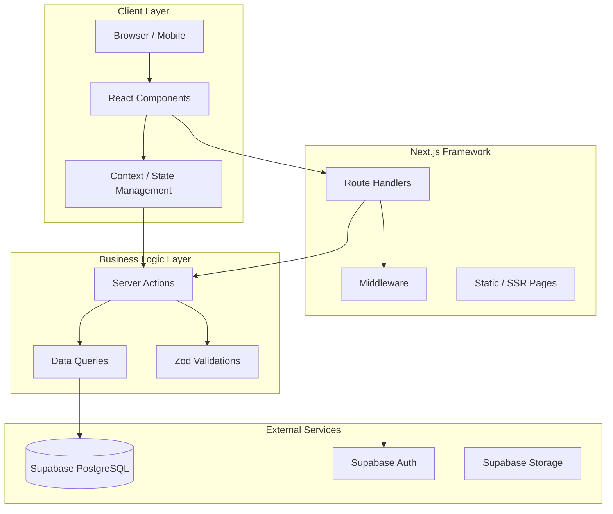

---

## Technology Stack

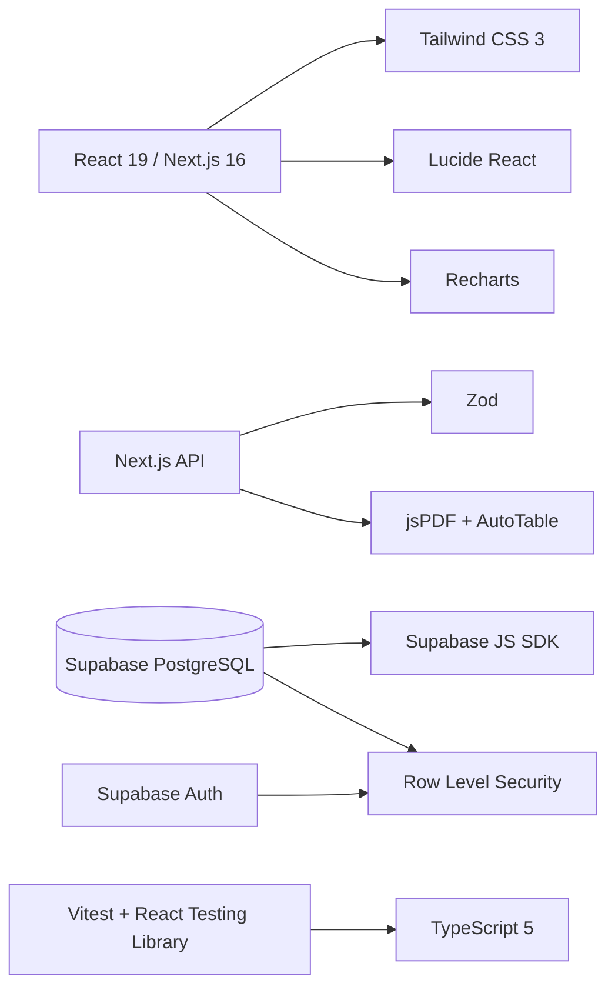

---

## Data Model

### Core Entities

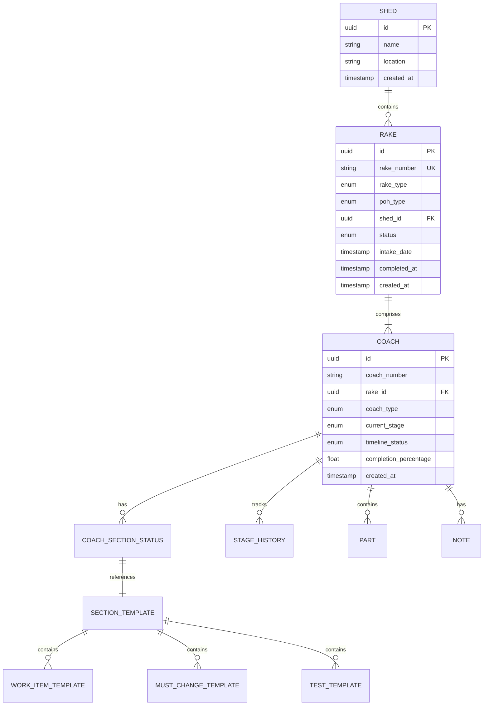

### POH Stages Flow

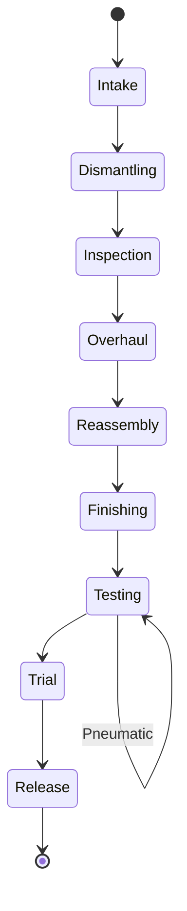

---

## Application Structure

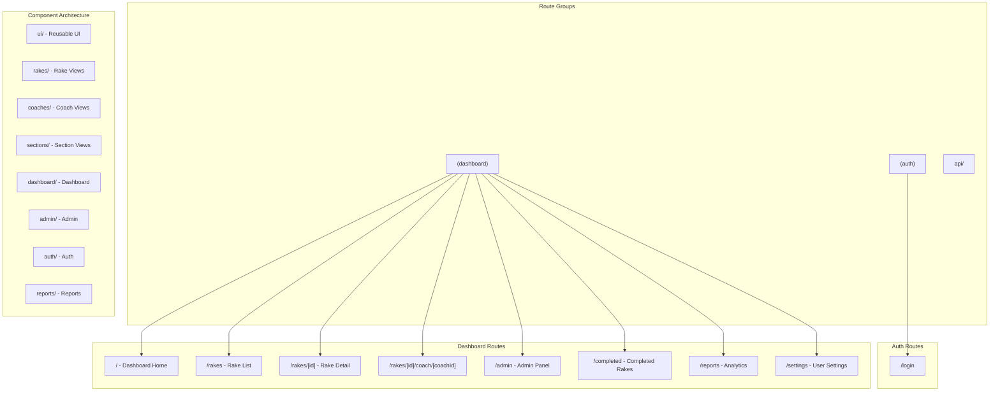

---

## Module Architecture

### Coach Section Workflow

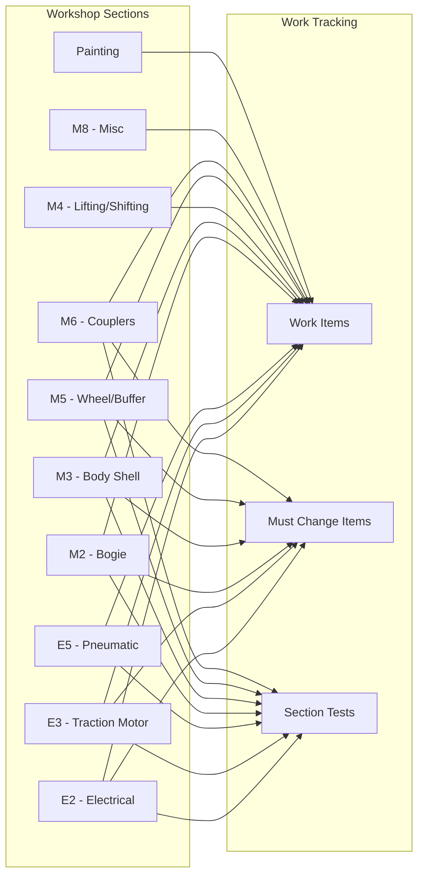

### Rake Lifecycle

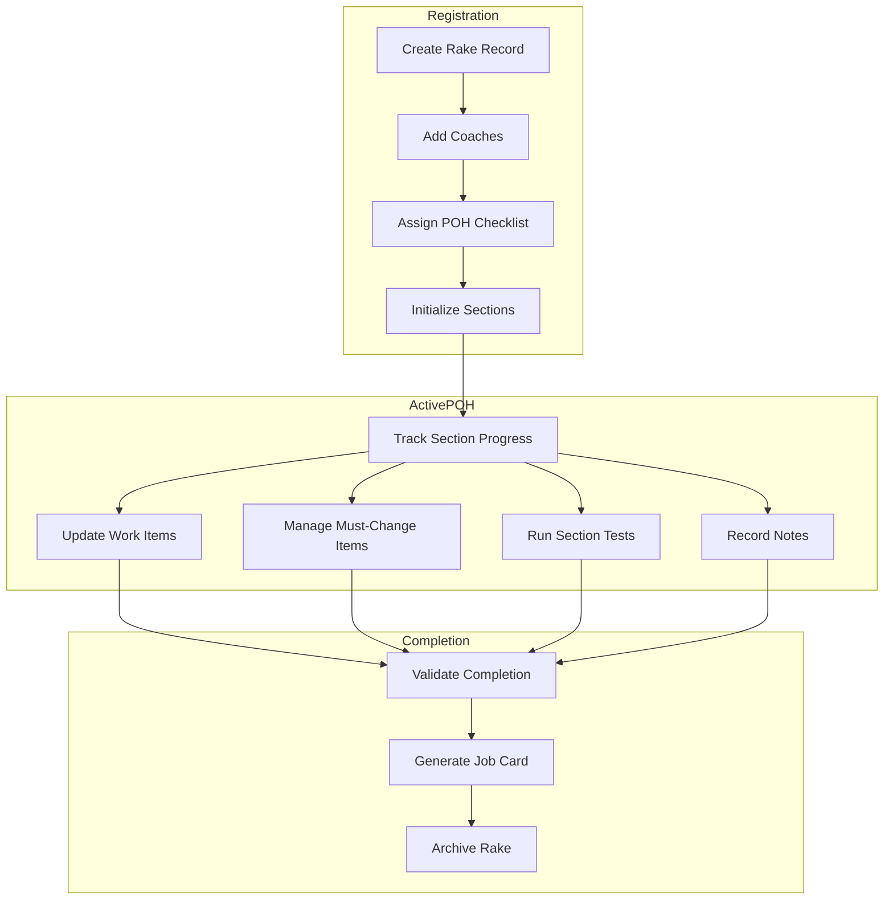

---

## Authentication & Authorization

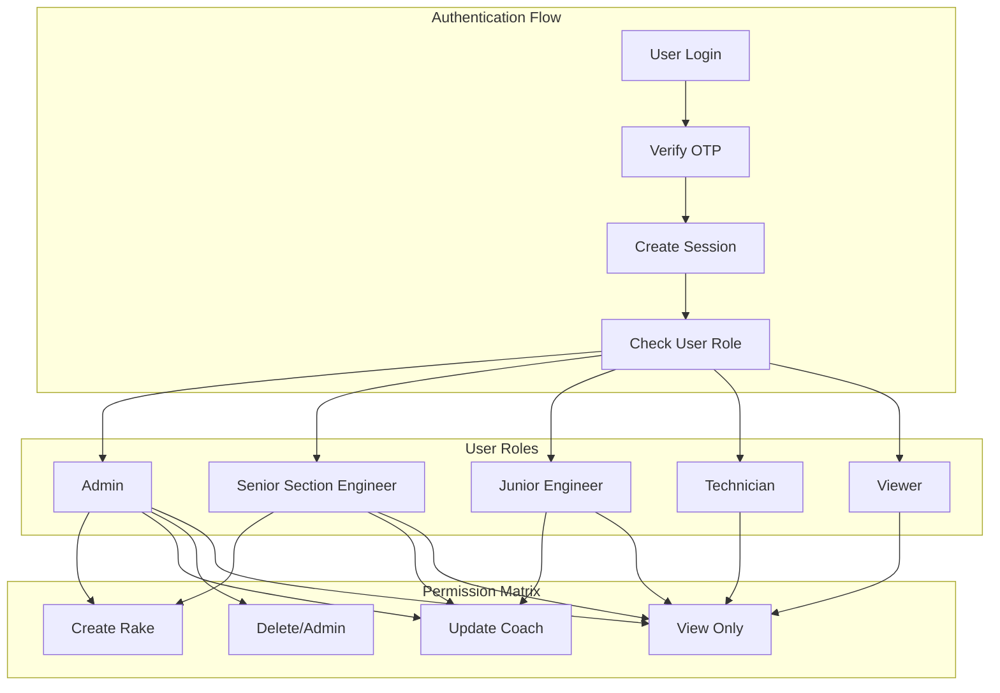

---

## Database Schema Overview

### Key Tables

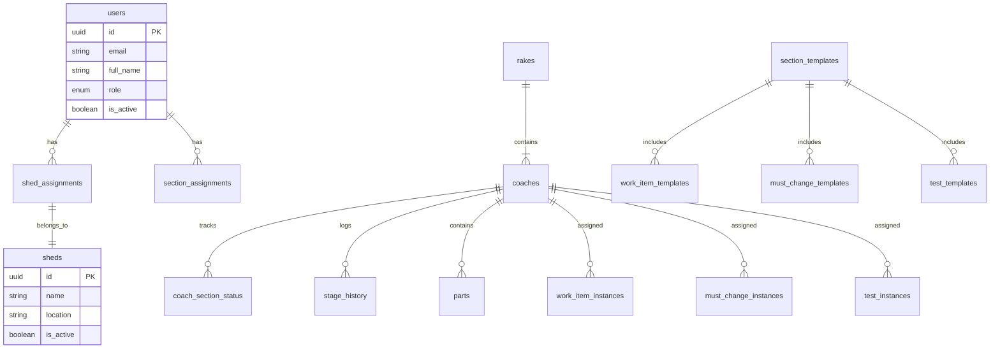

---

## API Structure

### Route Handlers

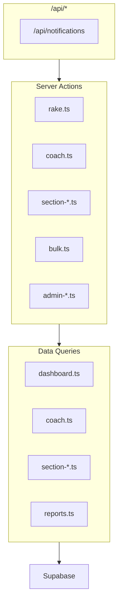

---

## Component Hierarchy

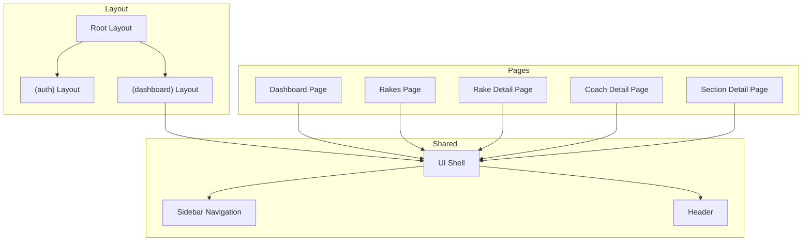

---

## Key Features Flow

### Job Card Generation

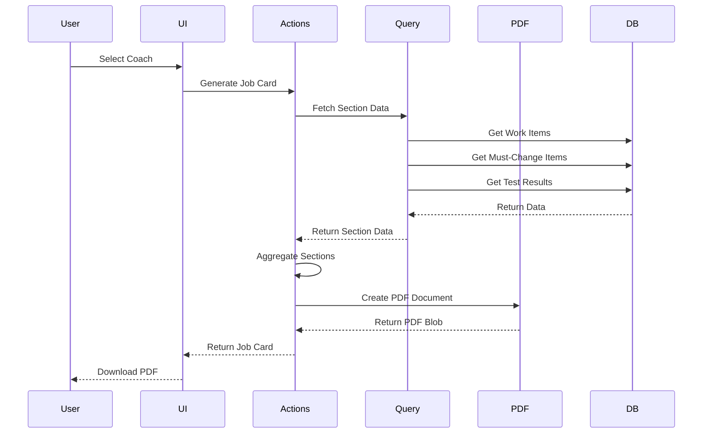

---

## Security Model

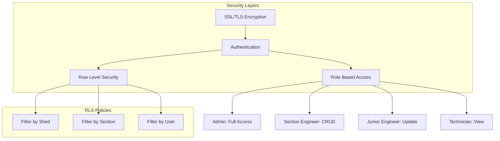

---

## Deployment Architecture

```mermaid
flowchart LR
    subgraph Dev["Development"]
        Local[Local Dev Server]
        HMR[HMR Enabled]
    end

    subgraph Build["Build Process"]
        TypeCheck[TypeScript Check]
        Lint[ESLint]
        Build[Next.js Build]
        Optimize[Asset Optimization]
    end

    subgraph Deploy["Deployment"]
        Vercel[Vercel Edge]
        CDN[Global CDN]
        Edge[Edge Functions]
    end

    Local --> TypeCheck
    TypeCheck --> Lint
    Lint --> Build
    Build --> Optimize
    Optimize --> Vercel
    Vercel --> CDN
    Vercel --> Edge
```

---

## Configuration

| Aspect | Technology |
|--------|------------|
| Language | TypeScript 5 |
| Framework | Next.js 16 (App Router) |
| Styling | Tailwind CSS 3 |
| Database | Supabase PostgreSQL |
| Auth | Supabase Auth |
| Validation | Zod |
| Testing | Vitest |
| PDF Generation | jsPDF |
| Charts | Recharts |
| Icons | Lucide React |

---

## Environment Variables

```bash
NEXT_PUBLIC_SUPABASE_URL=        # Supabase project URL
NEXT_PUBLIC_SUPABASE_ANON_KEY=  # Supabase anonymous key
```

---

## Future Considerations

- Mobile app for workshop floor technicians
- Barcode/QR code scanning
- Parts inventory integration
- Automated notifications (SMS/Email)
- Predictive analytics for delay forecasting
- IoT sensor integration